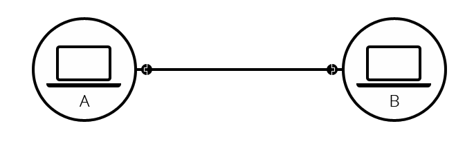
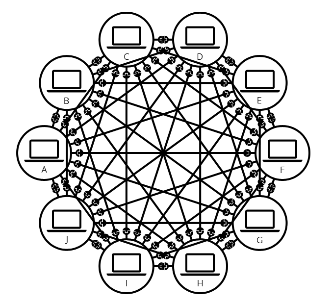
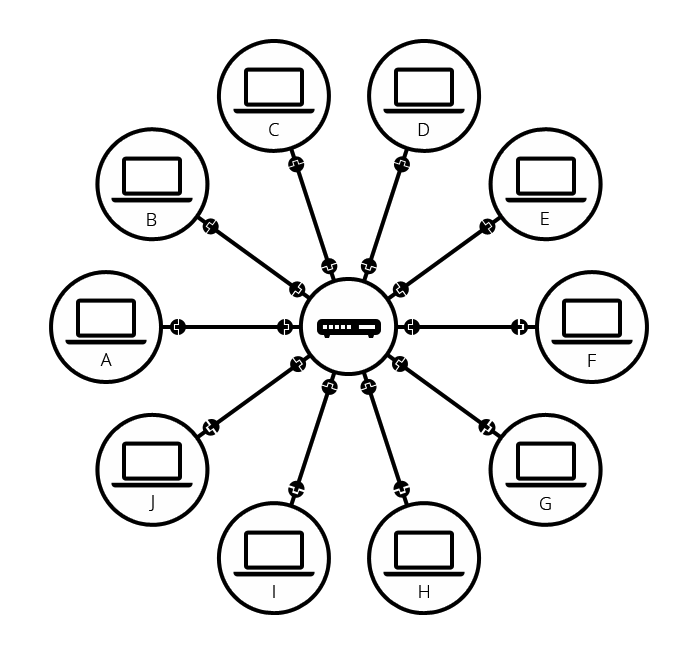
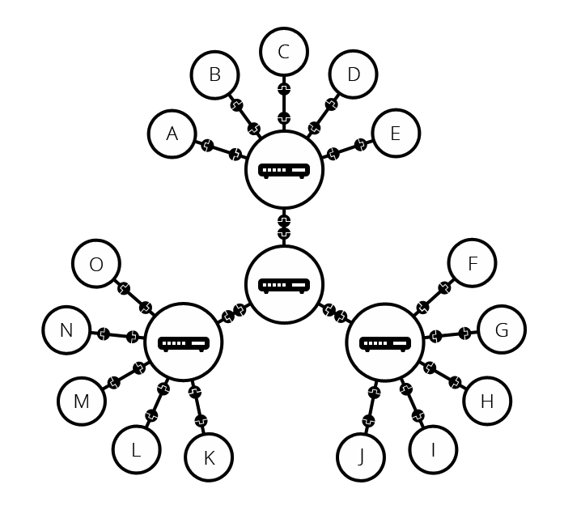
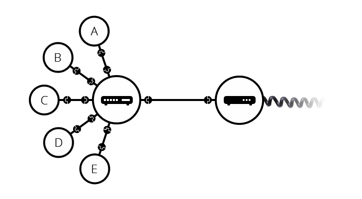
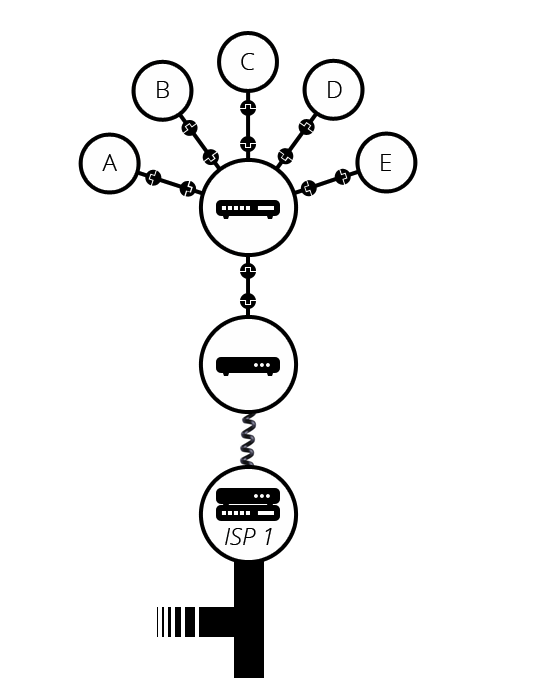
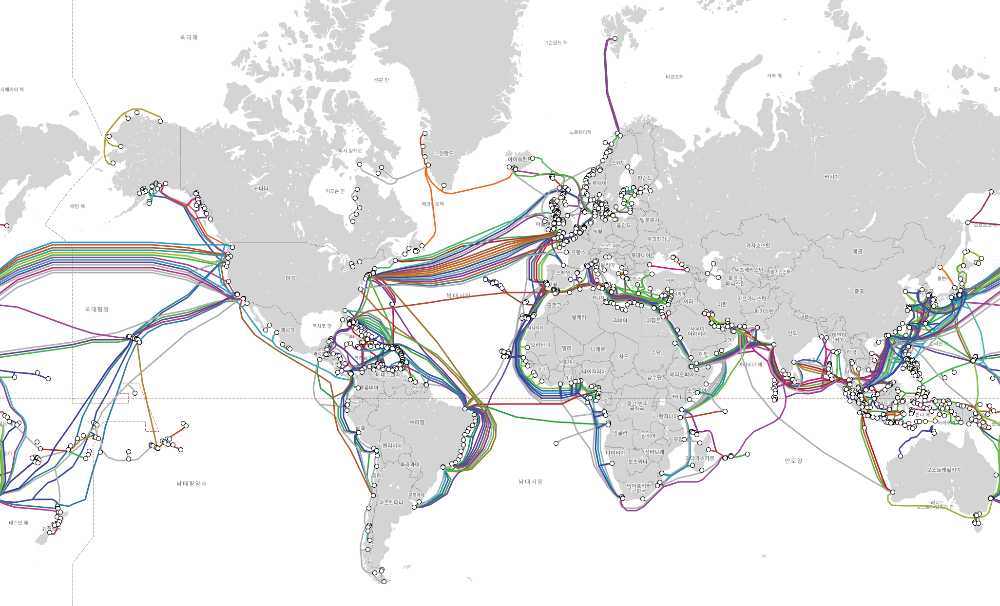
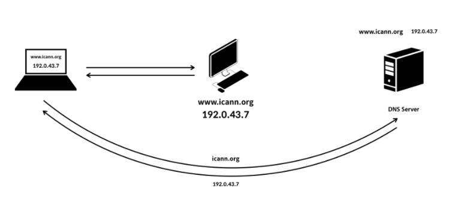
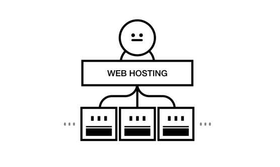

# 인터넷(Internet)

## 인터넷은 어떻게 동작하는가

인터넷을 세상에 탄생시킨 원인은 의외로 핵무기다. 최초의 인터넷이라 불리는 ARPANET은 다양한 범위를 타격할 수 있는 핵 미사일에
대비하여 재난 상황에서도 안전하게 데이터를 보관/전송할 수 있도록 설계되었는데, 이 ARPANET이 발전하여 우리가 알고 있는 인터넷이 탄생하게 되었다.

### 인터넷의 변화

컴퓨터는 물리적인 랜선으로 연결한다면 1:1로 서로간 통신이 가능하다.



그러나 여러 대의 컴퓨터를 연결하게 될 경우 필요한 랜선의 수가 기하 급수적으로 늘어난다.



이 문제를 해결하기 위해 탄생한 것이 라우터이다. 라우터는 우리가 아는 컴퓨터와 달리 딱 하나의 기능만 가진다. 철도역의 신호원 역할이 바로 그것이다.
이로 인해 중앙 집중 형태로 중안엔 라우터가, 변두리엔 컴퓨터들이 위치하여 서로 통신할 수 있게 되는 소형 네트워크가 만들어 질 수 있게 되었다.



라우터는 또한, 라우터끼리도 연결할 수가 있었기 때문에 랜선 길이만 충분하다면 무한한 확장이 가능했다.



하지만 그말은 즉, 랜선 길이가 유한하기 때문에 확장에 한계를 가진다는 말과 같았다. 사람들은 거리상의 물리적 한계를 극복해 내기 위해
이미 그 시절에 집집마다 인프라를 다 갖추고 있던 전화선을 이용해 먹기로 마음 먹었다. 컴퓨터간 주고 받는 통신 데이터를 전화 데이터로 변환하고,
또 역방향으로도 변환이 가능하게끔 하는 모뎀(MODEM, MOdulator and DEModulator)을 개발해낸 것이다.



그러나 모뎀만 있다고 해서 장거리 네트워크 연결이 무작정 이루어지는 것은 아니었는데, 이는 모뎀과 모뎀을 연결시켜주는 매개체가 필요했기 때문이다.
그 매개체가 바로 ISP(Internet Service Provider)이다. 우리나라엔 대표적으로 SK텔레콤, KT, LG 유플러스가 여기 해당된다.



이 ISP들은 마치 위에서 컴퓨터와 라우터간의 관계처럼 글로벌 ISP에 접속하거나, (비용을 아끼기 위한 목적으로) 지역 ISP에 접속하여
거대한 인터넷 망을 구축할 수 있게 해준다. 글로벌 ISP는 전세계에 [16개 정도 있다](https://en.wikipedia.org/wiki/Tier_1_network#List_of_Tier_1_networks) 고 알려져 있다.

대륙간에는 아래와 같이 해저 광학 케이블로 연결이 되어 있다.




## DNS와 동작 원리

위에서 설명한 라우터에서 라우터는 철도역의 신호원 역할을 한다고 했었다. 신호원은 각 신호가
'어디서부터 흘러들어와서 어디로 흘러가는지'를 검사해야 했는데, 이 과정에서 '어디'를 표현하기 위해 만드시 주소라는 개념이 도입될 수밖에 없었다. 즉 우리가 흔히
알고 있는 IP주소(Internet Protocol Address)가 바로 그 주소개념이다. 

그러나 인간들은 192.168.112.108 같은 숫자는 외우기 어려워 했다. 그 결과로 사람이 읽을 수 있는 글자로 IP를 바꿔주는 DNS(Domain Name Service)가 탄생하게 되었다.
예를 들어 IP 주소가 210.89.160.88 라고 했을 때 DNS는 이 주소를 www.naver.com으로 매핑을 시켜두고 기다리고 있다가,
누군가 www.naver.com에 접속하고 싶어하면 컴퓨터 간 통신을 하기 전에 해당 문자열을 IP 주소인 210.89.160.88로 변환시켜준다.




여기서 기다리고 있다가 요청이 오면 매핑시켜주는 역할을 하는 장치가 Domain Name Server인데, 보통 ISP가 이 역할을 겸한다.

### Domain Name

여기서 말하는 Domain Name은 당연하게도 네트워크안에서 곂쳐질 수가 없으며, 만약 그 네트워크가 인터넷인 경우 서로 더 좋은 Domain Name을 선점하기 위해
쓰이지도 않는 Domain Name을 미리 만들어 두었다가 팔기도 한다.

www.naver.com 에서 뒤에 붙는 .com은 국제적으로 쓰인다 하여
[글로벌 최상위 도메인](https://ko.wikipedia.org/wiki/%EC%9D%BC%EB%B0%98_%EC%B5%9C%EC%83%81%EC%9C%84_%EB%8F%84%EB%A9%94%EC%9D%B8) (global Top Level Domain)이라고 불린다.
종류로는 .com, .org, .net 등이 있다.

www.visa.go.kr 처럼 뒤에 붙는 .kr은 국가코드를 반영하는데,이런 도메인 네임을 보고 
국가 [코드 최상위 도메인](https://ko.wikipedia.org/wiki/%EA%B5%AD%EA%B0%80_%EC%BD%94%EB%93%9C_%EC%B5%9C%EC%83%81%EC%9C%84_%EB%8F%84%EB%A9%94%EC%9D%B8) (country code Top Level Domain)이라 한다. 

## Hosting



앞서서 예쁜 Domain Name을 미리 사두고 팔기 까지 한다고 했는데, 내가 Domain Name을 단지 소유하고 있기만 했다고 해서 멋진 웹사이트가
그 주소에 떡하니 보여지는 것은 당연히 아니다. 멋진 웹사이트가 눈앞에 펼쳐지기 까지 다음과 같은 것들이 필요하다.

- 도메인 네임 등록: 내가 구매해놓은 도메인 네임을 국제 DNS(Domain Name Server)에 등록되어 있어야 한다.
- 서버: 물리적으로 많은 컴퓨터의 수많은 요청을 처리할 수 있는 서버가 필요하다.
- 여러가지 서버 설정들: Database 는 어떤 것을 사용할 것인지, 캐쉬 서버, 로드벨런서 등등... 
- 웹사이트 코드: 멋진 웹사이트를 구성하고 있는 코드가 있어야 한다. 이 코드는 HTML/CSS/Javascript로도 충분히 만들 수 있다.

여기서 사용되는 서버는 통상 웹서버라고 부르며, 웹사이트가 항상 띄워지길 원한다면 이 서버는 냉장고마냥 밤낮없이 켜져 있어야 한다.
따라서 웹 서버를 관리하는 것은 쉬운 일이 아니며, 이에 따라 이를 쉽게 대행해주는 업체가 생겨났는데, 이들을 호스팅 업체라고 부른다.

그리고 이 호스팅과 여러 클라우드 컴퓨팅 기술이 결합되어 발달해오다가,
요새는 코드를 작성하는 일 외에 나머지 일들은 아마존이나 GCP(Google Cloud Platform)같은 곳에서 다 해준다. 복잡하고 비싸다는게 흠이긴 하지만...

## HTTP

앞서 나왔던 www.naver.com 은 우리가 URL(Uniform Resource Locator)이라고 부른다. 이 URL의 앞부분에는 `https://`라는 프로토콜이 붙는데,
이런 프로토콜이 명시되는 순간부터 URI(Uniform Resource Identifier)가 된다. 이 둘은 서로 매우 비슷하지만, 실은 URI가 URL을 포함하는 관계에 있다.

프로토콜이란 통신을 할 때에 필요한 상호간의 규약으로, 내가 전송할 데이터가 어떤 위치에 어떤 내용을 포함하고 있는지에 대한 약속이다.
컴퓨터끼리 기계어로 대화하기 때문에, 0101011101... 만 가지고는 어디서부터 어디까지가 어떤 데이터인지 알 수 없기 때문이다.
 
HTTP(Hypertext Transfer Protocol)은 그 이름에서 알 수 있듯이 인터넷 상의 문서를 가져오거나 전송하기 위해 설계되었다.
이 때, 가져오는 것은 Request라고 부르고, 그 신호를 받아 데이터를 전송하는 것은 Response라고 불리는데,
이 Request와 Response는 요약 정보를 담고 있는 헤더와 상제 정보를 담고 있는 body로 구분된다.

HTTP에서는 마치 사람의 대화처럼 '무엇을', '어떻게'하겠다 고 Request을 날리는데, '무엇을'에 해당하는 것이 바로 URI이고, '어떻게'에 해당하는 부분이 바로 메소드이다.

HTTP Method에는 다음과 같은 종류가 있다.

- GET: 특정 네트워크 자원을 가져오는 데 사용된다. 네트워크 자원이란 첨부파일, 웹 페이지, 웹 페이지의 스타일 시트 등을 말한다.
- POST: 엔티티를 서버에 생성하는 데 사용된다. 서버의 상태를 변경시킨다. 예로 회원 가입이 있다.
- PUT: 엔티티를 서버에 변경 요청을 하는 데 사용된다. 마찬가지로 서버의 상태를 변경시키며, 예로 회원 정보 수정이 있다. 
- DELETE: 엔티티의 삭제를 요청하는 데 사용된다. 마찬가지로 서버의 상태를 변경시키며, 예로 회원 탈퇴가 있다.

아랫 부분은 그냥 참고만.
- HEAD: 지정된 자원이 HTTP GET 메소드로 요청 될 경우 리턴되는 헤더를 요청한다.
- PATCH: 엔티티의 부분 수정을 요청하는데 사용된다.
- TRACE: 메시지의 루프백 테스트를 요청한다.
- OPTIONS: 대상 자원의 가능한 통신 옵션 목록을 요청한다.
- CONNECT: 서버에 터널링을 요청한다.

Response에서도 마찬가지로 '어떻게'의 결과와 그 결과가 성공적이라면 '무엇을'에 대한 결과값을 내려준다.
'어떻게'의 결과는 status code로 미리 다음과 같이 약속되어 있다.

- 200(OK): 응답 성공
- 400(Bad Request): Request에 이상이 있음
- 401(Unauthorized): 인증이 필요함
- 403(Forbidden): 접근 제한
- 404(Not Found): 못 찾았음
- 500(Internal Server Error): 요청을 수행하다가 문제가 생겼음

'무엇을'은 status code에 따라 단순한 에러메시지일 수도, 요청한 데이터가 들어있을 수도 있다.
만약 내가 웹 페이지를 요청했고, 그 요청이 성공했다면 요청한 데이터에는 html 파일 내용이 담겨있을 것이다.

## 브라우져

서버에서 내려주는 html내용은 말 그대로 html 형식일 뿐이지, 사용자에게 근사한 웹사이트처럼 보이지 않는다.
이 html을 근사한 웹사이트로 바꿔주는 역할을 하는 것이 브라우져이며, 흔히 아는 크롬, 엣지, 사파리, 파이어폭스 등이 대표적이다. 

### 브라우져의 구성 요소

- 사용자 인터페이스(UI): 우리가 보는 브라우져 화면이다.
- 브라우져 엔진: 우리가 하는 행동들(홈페이지 주소를 입력한다던가, 버튼을 누른다던가...)을 해석하여 렌더링 엔진의 동작을 제어한다.
- 렌더링 엔진: 렌더링을 담당한다. 렌더링이란 html, css등을 파싱하여 우리가 눈으로 보는 페이지를 화면에 뿌려주는 것을 말한다.
- 통신 모듈: 인터넷과의 통신을 담당한다.
- UI 백엔드: 아주 기본적으로 정의된 UI 컴포넌트(콤보박스, 라디오 버튼)들을 가지고 있다.
- Javascript Interpreter: Javascript 코드를 해석하고 실행시킨다.
- 자료 저장소(Data Storage): 쿠키, 세션 정보등을 저장하는 데 사용된다.

#### 렌더링 엔진의 동작 과정


크게 다음과 같은 플로우를 따른다.

1. HTML 파싱 후 DOM Tree만들기
    - 모든 마크업은 DOM Tree의 노드 하나와 1:1 매칭된다.
2. CSS/Style 파싱 후 나온 Style 데이터를 DOM Tree와 결합하여 Render Tree 만들기
    - 즉 Dom Tree는 컨텐츠를 담당하고 Render Tree는 시각적 요소를 담당한다.
3. Render Tree Layout 만들기
    - 각 Tree 노드가 스크린의 어떤 위치에 어떤 크기로 배치되어야 하는지를 계산한다.
3. Render Tree Painting
    - 먼저 렌더링이 가능한 컴포넌트들은 곧바로 화면에 순차적으로 렌더링 된다.

#### DOM (Document Object Model)
DOM은 위에서 설명하는 DOM Tree와 같다. 문서의 구조를 표현하는 트리라고 생각하면 된다.
DOM이 중요한 이유는 Javascript로 DOM을 컨트롤할 수 있기 때문이다.

즉, Javascript를 통해 DOM에 접근하여 데이터를 가져오거나, 노드를 제어하는 등의 처리가 가능하다.
예를 들어 다음과 같은 코드는 html 작성 없이도 HTML Element를 DOM 에 심을 수 있게 해준다.

```javascript
window.onload = function() {
  // create a couple of elements in an otherwise empty HTML page.
  var heading = document.createElement("h1");
  var heading_text = document.createTextNode("Big Head!");
  heading.appendChild(heading_text);
  document.body.appendChild(heading);
}
```

다음과 같이 이미 존재하는 노드에 접근하여 제어할 수도 있다.
```javascript
document.getElementById('container').style.backgroundColor = 'red'
document.getElementById('container').remove()
```

DOM에서는 이런 식으로 javascript에서 DOM을 컨트롤할 수 있게끔 인터페이스를 제공하는데, 사실 javascript만 컨트롤할 수 있는 건 아니다.
그 이유는 DOM의 인터페이스들이 특정한 언어에 의존하도록 설계되지 않았기 때문이다. 따라서 파이썬 같은 언어로도 컨트롤이 가능하다.
