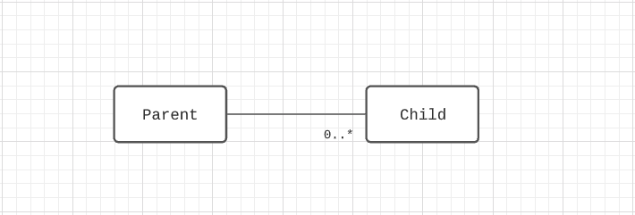
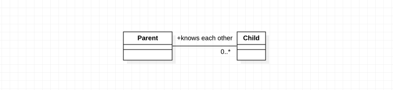
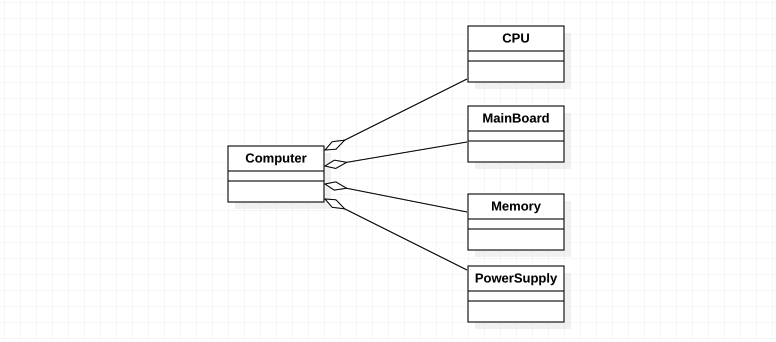
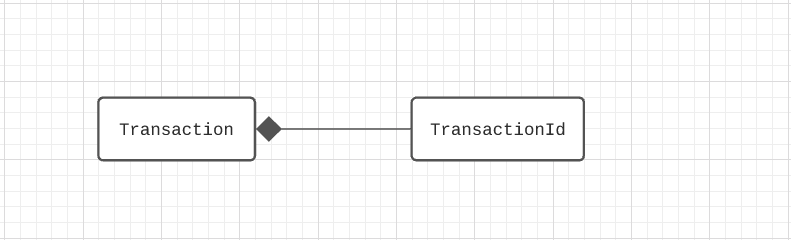
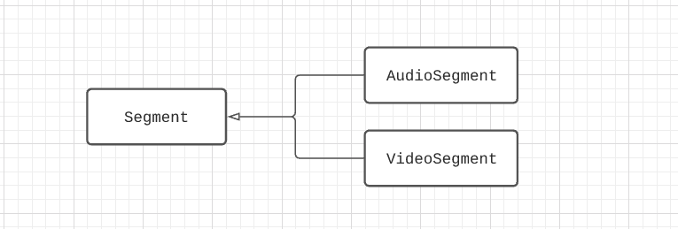
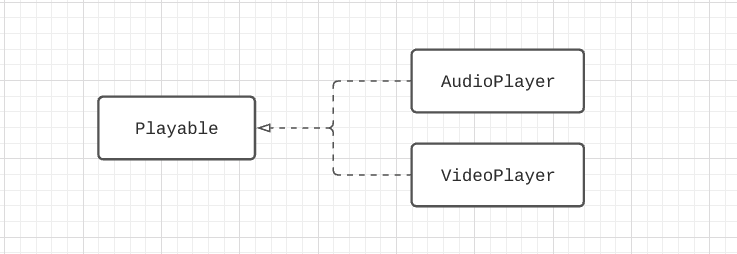
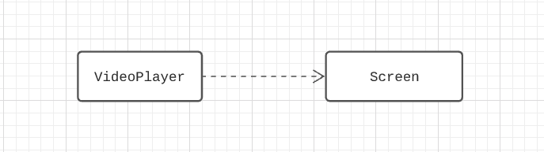

# UML

## Overview

소프트웨어 개발에서는 설계단계에서부터 구현까지 정말 많은 그림과 도표들이 시스템을 묘사하기 위해 사용된다.
시스템이 어떤 문제 영역(도메인)을 해결해야 하고, 그를 위해 어떤 기능을 수행해야 하는지 정해지고 나면, 크게 다음과 같이 구체화한다.

* 시스템 컨텍스트 정의
* 유스케이스 정의
* 도메인 모델 정의
* 특정 시퀀스(플로우) 정의
* 특정한 상황에서 시스템 상태 정의
* 기타

아래로 갈수록 점점 구체화되는 것이 보일 것이다. 그러나 위에서 아래의 순서대로 소프트웨어가 개발되는 것은 아니다.
실제 프로젝트에서는 이 추상화 단계들이 동시에 발생한다.

시도 때도 없이 발생하는 각각의 추상화 단계에서 개발자들, 혹은 비 개발자들까지도 의사소통을 하기 위해
사람들이 주로 택하는 편리한 의사소통 방식은 바로 그림을 그리는 것이다.
그러나 모두가 그림을 그리는 방식이 다르다 보니 이에 불편함을 느낀 사람들은 아예 이러한 그림들을 표준화하고자 했는데,
때문에 각각의 상황마다 쓰이는 그림에 대한 용어와 그림을 그리는 규칙들이 정해지게 되었다.

## 정말 필요하지 않으면 하지 말아라

아래로 넘어가기 전에 한 가지 명심해야 할 규칙은 **'그 필요가 급박하고 중요하지 않다면 아무 문서도 만들지 마라'** 는 엉클 밥의 문서화 제 1법칙이다.

시스템이 너무나 간단하다면 시스템 컨텍스트 정도만 문서에 묘사되어 있어도 충분할 것이다. 그러나 조금 더 복잡하다면 유스케이스나 도메인 모델이
별도로 묘사되어야 할 것이다. 특정 상황이 너무나 복잡하고 동시성과 관련해서 다른 개발자들이 알아두어야 하는 내용이 있다면
시퀀스나 시스템 상태를 따로 묘사하는 게 좋을 것이다. 혹은, 도메인 모델만으로 충분해서 유스케이스에 대한 정의가 필요가 없어질 수도 있다.
 
이런 식으로 시스템의 복잡도 때문에 문서화의 필요성이 느껴지거나, Design Alternatives 를 두고
왜 이 디자인을 선택했는지에 대한 기록을 남겨야 할 때 등 정말 필요할 때만 문서로 만들어야 한다. 그렇지 않으면 문서를 작성하는 시간과 노력
뿐만 아니라, 그것을 유지보수하는 데도 에너지를 낭비하게 된다.

## 그림들의 종류

굉장히 많은 종류의 그림(도식)들이 있지만, 대표적으로 꼽아보자면 다음과 같다.

* 시스템 컨텍스트 정의: 시스템 컨텍스트 다이어그램
* 유스케이스 정의: 유스케이스 다이어그램
* 도메인 모델 정의: 도메인 모델 다이어그램, 클래스 다이어그램
* 특정 시퀀스(플로우) 정의: 시퀀스 다이어그램
* 특정한 상황에서 시스템 상태 정의: 객체 다이어그램, 활동 다이어그램
* 기타: 패키지 다이어그램

### 시스템 컨텍스트

시스템 컨텍스트는 내가 만들고자 하는 시스템이 외부와 어떻게 연결되어 있는지에 대한 설명이다. 말 그대로 내가 어떠한 맥락에서 이 시스템을 만들어야 하는지를 서술하는 것이다.

### 유스케이스

유스케이스는 시스템이 어떠한 기능을 할 수 있는지 사용자(보통 Actor 라고 부른다) 입장에서 묘사한 것이다.

### 도메인 모델

도메인 모델은 유스케이스에 등장하는 용어나 개념들 그리고 그것들의 관계에 대한 묘사이다. 유스케이스 분석을 하지 않았다면, 도메인에 등장하는 개념들이라고 생각하면 된다.
그러나 도메인 모델을 만들었다고 해서 반드시 소프트웨어의 객체 지향 설계와 대응해야 하는 것은 아니다.

도메인 모델을 토대로 소프트웨어의 설계를 직접적으로 드러낼 수 있는 것은 클래스 다이어그램이다.
그러나 구체적일수록 변경되기 쉬우므로, 문서에 클래스 다이어그램을 넣는 것은 신중히 결정해야 한다.

개인적으로는, 클래스 다이어그램에서 인터페이스나 프로퍼티는 빠뜨린.. 도메인 모델도 클래스 다이어그램도 아닌 일종의 혼종(?)을 문서에 도입하기도 한다.

### 시퀀스

특정 상황에 어떤 컴포넌트가 다른 어떤 컴포넌트에게 어떤 요청을 하고, 어떤 응답을 받고, 결과적으로 어떤 작업을 수행하는지에 대한 설명이다.
말그대로 시스템이 이 순간에 어떤 순서대로 흘러가야 하는지를 담는다.

### 시스템 상태

멀티스레딩 시스템이라면 시퀀스 다이어그램으로 설명하기 힘들 수도 있다. 이럴 때 사용하는 것이 활동 다이어그램이다.
또, 어떠한 특정한 시각에 객체들 사이에 존재하는 정적인 관계를 설명하고자 한다면 객체 다이어그램을 사용한다.

## UML

위에서 말한 표준화, 그림 그리는 규칙을 정의하기 위해 나온 것이 UML(Unified Modeling Language)이다. 놀랍게도 위에서 설명한 모든 종류의 그림은 UML로 나타낼 수 있다.

문서화 과정 중 우리가 그려야하는 그림에서 개인적으로 가장 중요하다(드러내야 한다)고 생각하는 것은 바로 의존성에 대한 표기이다.
UML에서는 의존성에 대해 화살표 혹은 직선으로 표기를 하는데, 여기서는 이 의존성 표기법에 대해 정리하려고 한다.

### 연관(Association)

연관되다라는 건 마치 친구사이처럼 서로를 잘 알고 있다라는 뜻이다. 각 클래스에서 만들어진 인스턴스가 서로에게 메시지를 보낼 수 있는 것이다.
연관은 어떤 클래스에서 다른 클래스를 가리키는 포인터가 되거나 참조하는 인스턴스 변수의 형태로 제일 빈번하게 구현된다.



아래 예시에서 `Parent`는 `Child`의 타입과 `setParent` 인터페이스를 알고 있고, `Child`는 `Parent`의 타입과 `getName` 인터페이스를 알고 있다.
```typescript
class Parent {
  private children: Child[]

  addChild (child: Child): void {
    this.children.push(child)
    child.setParent(this)
  }
  
  getName (): string {}
}

class Child {
  private parent: Parent

  setParent (parent: Parent): void {
    this.parent = parent
  }
  
  getParentName (): string {
    return this.parent.getName()
  }
}
```

방향이 있는 연관(Navigable Association)도 있는데, 둘 중에 한 쪽은 다른 쪽을 모른다는 의미다.



아래 예시에서 `Car`는 `Person` 에 대해 전혀 알지 못한다.

```typescript
class Person {
  private car: car

  buyCar (car: Car) {
    this.car = car
  }

  drive() {
    car.move()
  }
}

class Car {
  move() {
    //... 
  }
}
```

#### 집합(Aggregation)

집합은 서로를 알고 있지만 '전체/부분'의 관계를 표현한다는 점에서 연관의 특별한 형태라고 볼 수 있다. 그러나 암시한다는 것일 뿐, 연관과
큰 차이는 없다.



아래 예시에서는 `Computer`가 모든 구성품들의 집합체가 된다.

```typescript
class Computer {
  private cpu: Cpu
  private mainBoard: MainBoard
  private memory: Memory
  private powerSupply: PowerSupply

  constructor (
    private readonly cpu: Cpu,
    private readonly mainBoard: MainBoard,
    private readonly memory: Memory,
    private readonly powerSupply: PowerSupply
  ) {
  }
}

class Cpu {}
class MainBoard {}
class Memoy {}
class PowerSupply {}
```

#### 합성(Composition)

집합이 연관의 특별한 형태라면, 합성은 연관의 특별한 형태이다. '전체'가 자기사 소유한 '부분'의 생명주기에 책임이 있음을 의미하기 때문이다.
이 때 생명주기에 책임을 진다는 의미는 직접 '부분'을 삭제하거나, 그 책임을 받아들인 다른 엔티티에 '부분'을 넘긴다거나 하여 '부분'이 삭제되도록 만들어야 함을 의미한다.
생명주기를 책임지는 만큼 합성은 강한 결속이기 때문에 외부에서 '전체'에게만 의존하도록 하기 위해 캡슐화되어 사용되는 경우가 일반적이다.
즉, '부분'의 기능을 '전체'에 접근하여 얻도록 설계된다.

집합에서는 이와는 달리, '부분'의 기능을 사용하기 위해 '전체'에 접근할 필요는 없으며, '전체'가 소멸되어도 '부분'의 생존이 가능하다.
즉, `Computer`를 폐기처분 하더라도 `Memory` 같은 걸 다른 컴퓨터에 끼워 재사용할 수 있는 것이다.



아래 예시에서는 `Transaction` 이 소멸되면 `TransactionId`도 같이 소멸된다.

```typescript
class Transaction {
  private transactionId: TransactionId

  constructor () {
    this.transactionId = new TransactionId()
  }
}

class TransactionId {}
```

### 일반화(Generalization)

일반화는 상속을 통해 표현할 수 있다. 현실에서 우리는 성급한 일반화를 하지 않도록 주의하곤 하는데, 소프트웨어 영역이라고 다르지 않다.



아래 예시에서 `VideoSegment` 와 `AudioSegment`는 `Segment`로 일반화되었다. 일반적으로 모든 `Segment`들은 재생 시간(`playingTime`)을 갖는다는 의미이다.

```typescript
class Segment {
  protected playingTime: number

  constructor () {} 
}

class VideoSegment extends Segment {}
class AudioSegment extends Segment {}
```

### 실체화(Realization)

실제화는 인터페이스를 구현함으로써 표현할 수 있다.



아래 예시에서 `AudioPlayer` 와 `VideoPlayer`는 `Playable` 이라는 추상적인 행위를 구현함으로써 실제화하였다.

```typescript
interface Playable {
  play (): void
}

class VideoPlayer implements Playable {
  play (): void {
    // Play video...
  }
}

class AudioPlayer implements Playable {
  play (): void {
    // Play audio...
  }
}
```

### 의존(Dependency)

A가 B에 의존한다는 것은 B에 변경이 일어났을 때 A 역시 마찬가지로 변경이 일어난다는 뜻이다. 연관과 헷갈릴 수 있는데,
연관은 1:1, 1:N, M:N 등 객체끼리 관계를 가지는 경우를 생각하면 되고, 의존은 메소드의 파라미터로 다른 객체를 받아들이거나 다른 객체를 리턴하는 경우를 생각하면 된다.  



아래 예시에서 `VideoPlayer`는 `Screen`에 의존한다. 

```typescript
class VideoPlayer {
  play (screen: Screen): void {
    screen.setStartTime(new Date())
    // ...
  }
}

class Screen {
  setStartTime (time: Date): void {
    // ...
  }
}
```
