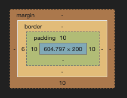
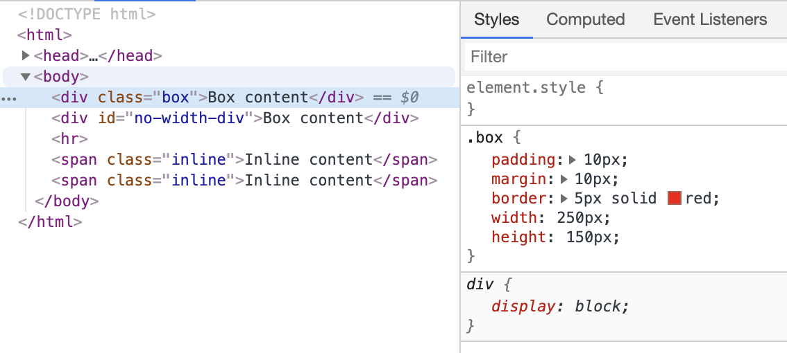
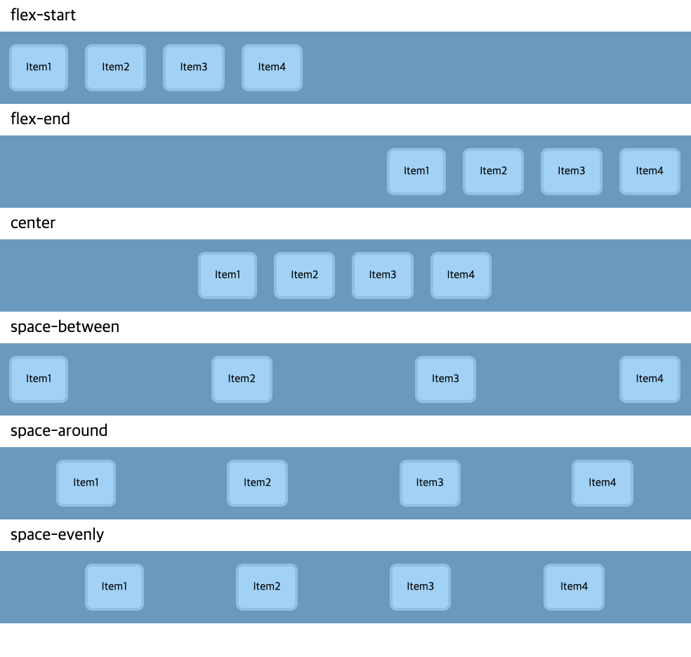
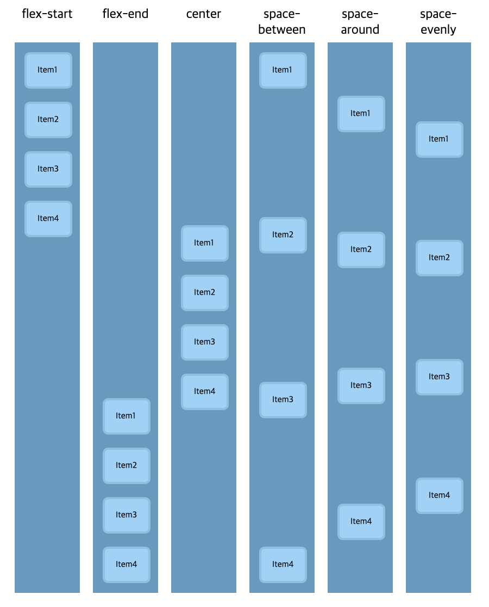
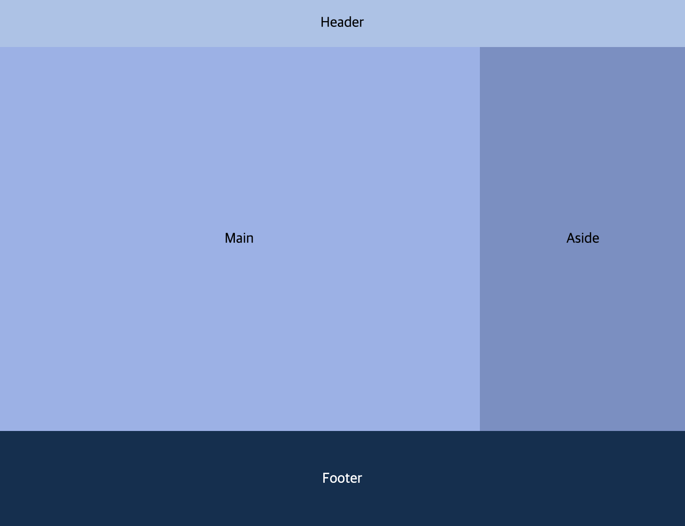

# CSS

CSS(Cascading Style Sheets)는 웹페이지를 디자인하기 위해 고안된 Style sheet 언어다. html로만 문서를 읽기에는 아무래도 심심했기 떄문이다.

CSS를 사용하기 위해서는 `<head>`안에 `<style>` 태그를 열어서 그 안에서 sheet 내용을 표현하는 방법이 있다.
가령 아래 마크업은 "`This is a paragraph.`" 부분이 왼쪽으로부터 20 픽셀의 간격이 생기고 색이 빨간색이 된다.

먼저 `<style>` 태그를 열어서 아래 내용을 복사 + 붙여넣자.
```css
p {
  color: red;
  padding-left: 20px;
}
```

`<body>` 안의 내용은 다음과 같다.

```html
<h3>This is a Heading</h3>
<p>This is a paragraph.</p>
```

결과를 확인해보자:

<div style="background-color: #eeeeee; padding: 1em;">
  <h3>This is a Heading</h3>
  <div style="color: red; padding-left: 20px;">This is a paragraph.</div>
</div>

CSS 부분만 좀 더 자세히 살펴보면 다음과 같은 구조를 가진다:

```css
selector {
  property1: property value 1;
  property2: property value 2;
}
```

- 선택자(`selector`): HTML 요소 중 꾸며줄 요소를 선택한다. 예제에서는 `p` 태그가 선택되었다.
- 속성(`property`): 꾸밀 대상의 어떤 속성을 꾸밀지 결정한다. 예제에서는 `color`속성을 꾸미기로 결정했다.
- 속성 값(`property value`): 꾸밀 대상을 어떻게 꾸밀지 결정한다. 예제에서는 `red`하게 꾸미기로 결정했다.

끝나는 부분에 반드시 `;`가 와야한다는 것에 주의하자.

## CSS Selector

위 예제에서 만약 `<p>`태그가 여러 개 존재한다면 어떻게 될까? 모든 `<p>`로 감싸진 부분들은 같은 스타일이 적용되게 된다.
부분적으로 스타일링을 다르게 하고 싶어 HTML 요소 중 모든 `p` 태그를 선택하고 싶지 않거나,
`<p>`뿐만 아니라 다른 여러 태그에 한꺼번에 같은 스타일을 적용하고 싶을 수도 있다.

그러기 위해 알아야 하는 것이 아래에서 소개될 Selector Rule이다.

> 한 가지 중요한 점은, Selector 종류는 굳이 달달 외울 필요가 없다는 것이다. 모르겠으면 구글링을 하면 되고, 현직자들도 그렇게 한다.
> 참고할 만한 사이트는 인터넷에 차고 넘치기 때문이다. 그 예로 [w3schools](https://www.w3schools.com/cssref/css_selectors.asp) 가 있다.

### 다중 선택

`,`를 이용하여 selector를 구분지으면 여러가지 태그를 한꺼번에 선택할 수 있다:

```css
p, h1 {
  color: red;
  padding-left: 20px;
}
```

### 자식 선택

마크업이 아래와 같다고 하자:

```html
<div>
  <p>나는 선택 받았다.</p>
</div>

<div>
  <span><p>span 때문에 가로막혀 선택받지 못한다.</p></span>
  <div>
    <p>나도 선택 받았다.</p>
  </div>
  <p>오, 나도 선택 받았다.</p>
</div>

<p>부모가 div가 아니라서 선택받지 못한다.</p>
```

`>`를 이용하여 selector를 구분지으면 부모가 `<div>`인 `<p>` 태그를 선택할 수 있다.

```css
div>p {
  color: red;
}
```

` ` (공백)을 이용하여 selector를 구분지으면 조상이 `<div>`인 `<p>` 태그 모두가 선택된다.

```css
div p {
  background-color: #F2D7C3;
}
```

적용해보면 `<span>` 때문에 가로막혔던 `<p>` 까지 선택되는 걸 볼 수 있다.

### ID 를 이용한 선택

```html
<span>같은 id는</span>
<span id="red-div">절대</span>
<span>2개 이상 존재해선 안된다.</span>
```

마크업이 위와 같다고 할 때, `#`을 이용하여 해당 ID로 마킹된 태그만 선택할 수 있다:

```css
#red-div {
  color: red;
}
```

마크업에 써있듯이, ID는 곂치지 않고 유일해야 한다.
설령 중복되더라도 동작되는 것처럼 보일 수는 있지만, 이는 표준이 아니므로 모든 브라우져에서 같은 결과를 낼 거라 보장할 수 없기 때문이다.

### Class 를 이용한 선택

단 하나만 선택하는 것은 역시 불편하다. 여러 같은 태그들 중에서 2개 이상을 선택하고 싶을 수도 있기 때문이다.
이 때 사용가능한 것이 바로 class를 이용한 선택이다.

```html
<div class="red-box">red box</div>
<div class="blue-box">blue box</div>
<div class="red-box">red box</div>
<div class="blue-box">blue box</div>
<div class="red-box">red box</div>
<div class="blue-box">blue box</div>
```

마크업이 위와 같다고 할 때, `.`을 이용하여 해당 Class로 마킹된 태그들을 선택할 수 있다.

```css
.red-box {
  width: 100px;
  height: 100px;
  margin: 12px;
  background-color: #f26672;
  display: flex;
  align-items: center;
  justify-content: center;
}
.blue-box {
  width: 100px;
  height: 100px;
  margin: 12px;
  background-color: #6672f2;
  display: flex;
  align-items: center;
  justify-content: center;
}
```

한 태그가 여러 Class 를 가질 수도 있다. 이 때 클래스 끼리는 공백(` `)으로 구분지어진다. 예를 들어:

```html
<div class="red box">red box</div>
```

이 요소는 `red` 클래스와 `box` 클래스 모두에게 해당된다. 예제에 나왔던 마크업을 위와 같은 형식으로 바꾸게 된다면,
CSS는 다음과 같이 중복된 부분을 줄일 수 있게 된다.

```css
.red {
  background-color: #f26672;
}
.blue {
  background-color: #6672f2;
}
.box {
  width: 100px;
  height: 100px;
  margin: 12px;
  display: flex;
  align-items: center;
  justify-content: center;
}
```

> 개발자에게 있어 중복은 나태함의 증거이자 남을 배려하지 않는 크나큰 죄악이다.
> 같은 결과를 달성하기 위해 가능한 방법이 여럿 존재한다면, 중복이 가장 적은 길을 선택하자.

### 속성을 이용한 선택

특수한 속성이나 속성 값을 가진 요소에 대해 스타일을 적용하고 싶을 수도 있다. 마크업이 다음과 같다고 하자.

```html
<div>
  모르는 게 있다면 <a href="www.google.com">구글</a>에 물어보자.
</div>
<div>
  아니면 <a href="www.naver.com">네이버</a>도 나쁘지 않다.
</div>
<div>
  하지만 기왕이면 <a href="https://poqw.github.io">이 블로그</a>를 방문하는 게 좋다.
</div>
```

가장 아래에 있는 `<a>` 태그만 강조하고 싶다면 `[property=property-value]` 를 이용한 다음 스타일을 사용한다:
```css
a[href="https://poqw.github.io"] {
  color: red;
  font-weight: bold;
}
```

### 슈도(Pseudo) 클래스를 이용한 선택

특정 요소가 특정 상태에 있을 때 해당 요소를 선택하고 싶을 수도 있다. 위와 마크업이 같다고 했을 때:

```css
a[href="https://poqw.github.io"] {
  color: red;
}
a {
  text-decoration: none;
  color: black;
}
a:hover {
  font-size: 30px;
}
```

위와 같이 `:status` 를 이용해 특수한 상태에 있는 요소를 선택할 수 있다.

## 박스 모델 레이아웃


우리가 보는 화면은 대부분 사각형 모양이다. 원래 웹사이트라는 것이 네모난 종이에서 보던 글(정보)들을 그대로 컴퓨터 스크린에 볼 수 있도록
옮겨놓으려 했던 것이기 때문에, 자연스럽게 일반적인 종이와 같이 직사각형 모양의 화면이 오늘 날의 모니터 스크린이 된 것이다.

뉴스 기사를 생각해보자. 우리가 옛날부터 봐오던 종이에는 그냥 일렬로 글만 써있던 것이 아니었다. 헤드라인, 사이드, 리드, 본문, 각주 등
읽는 사람의 가독성을 고려하여 공간이 분리되어 있었다. 스크린에도 이런 공간 분할이 자연스럽게 반영되어야 할 필요성이 있었는데, 그 때문에
CSS는 박스 모델 레이아웃을 기반으로 설계되었다. 여기서의 박스는, 앞서 예시를 들었던 공간들에 해당된다고 볼 수 있다.

### Box 의 속성

Box는 `padding`, `border`, `margin`, `width`, `height`, `background-color`, `color` 등의 속성을 가질 수 있다. 지금부터 차근차근 알아보자.

### Box padding, border, margin


뉴스 기사 잡지의 한 컬럼을 떠올려 보았을 때, 컬럼은 테두리(border)를 가질 수도 있었고, 테두리 안과 바깥에는 항상 여백(margin, padding)이 들어간다.
따라서 이러한 공간을 표현하기 위해 박스 역시 기본적으로 다음과 같은 속성을 가진다.

- padding: 컨텐츠 주위의 공간
- border: padding의 바깥쪽에 놓인 선, 즉 테두리.
- margin: 박스의 바깥쪽을 둘러싼 공간

이 때, padding 보다 안 쪽의 공간을 `content area` 라고 부른다.

모든 HTML의 태그들은 결국 이러한 박스 모델로서 표현되어 화면에 나타나진다.
그 말은 즉, 어떠한 HTML tag더라도 박스가 가지는 위 속성을 모두 가질 수 있다는 말이다.
예를 들어 아래와 같은 마크업이 있다고 하자.

```html
<div id="box">Simple content</div>
```

`<div>` 는 위에서 설명한 대로 박스 모델을 가지므로, 결국 다음과 같은 스타일을 적용할 수 있다.

```css
#box {
  padding: 10px;
  margin: 10px;
  border: 5px solid red;
}
```

아래 그림은 크롬의 개발자 도구를 열어서 특정 컴포넌트를 선택했을 때 나오는 화면인데, 해당 컴포넌트의 박스 속성을 한 번에 볼 수 있다.



#### Box width, height

Box 는 마찬가지로 크기를 가질 수 있다. 여기서 크기는 가로 길이와 세로 길이로 결정되는데, 각각 `width` 와 `height` 다.


```css
#box {
  width: 250px;
  height: 150px;
}
```

HTML 요소에서는 `block` 요소와 `inline` 요소가 있다고 했었다. Box 요소는 반드시 줄바꿈이 일어나고 화면 스크롤 방향으로 (마치 박스 그 자체처럼)쌓여갈텐데,
줄바꿈이 일어난다는 것은 `width` 가 화면을 저절로 꽉 채우도록 설정되어 있다는 말이 아닐까?

정답을 이야기 하자면, 반은 맞고 반은 틀렸다. 확실히 `block` 속성을 가진 HTML 요소들은 `width`를 정해주지 않으면 화면 전체 가로 너비만큼(100%)의
`width` 가 자동으로 할당된다. 그러나 너비를 화면 전체 크기의 반절 이하로 줄였다고 해서, 한 줄에 2개의 박스가 들어가거나 하지 않고,
여전히 줄바꿈이 된다. 다음 예제로 확인해보자.

```css
.block-element {
  padding: 10px;
  margin: 10px;
  border: 5px solid red;
  width: 250px;
  height: 150px;
}
#no-width-block-element {
  padding: 10px;
  margin: 10px;
  border: 5px solid red;
  height: 150px;
}
```

마크업은 다음과 같다:

```html
<div class="block-element">Box element</div>
<div class="block-element">Box element</div>
<div id="no-width-block-element">Box element</div>
```

결과는 다음과 같다.

<div style="background-color: #eeeeee; padding: 1em;">
  <div style="padding: 10px; margin: 10px; border: 5px solid red; width: 250px; height: 150px;">Box content</div>
  <div style="padding: 10px; margin: 10px; border: 5px solid red; width: 250px; height: 150px;">Box content</div>
  <div style="padding: 10px; margin: 10px; border: 5px solid red; height: 150px;">Box content</div>
</div>

그렇다면 여기서 궁금증이 생긴다. inline 요소들에 `width` 와 `height` 를 적용하면 어떻게 될까? inline 요소들 역시 박스 모델 레이아웃 영향을 받기 때문에
박스 형태로 화면에 나타내어 진다. 그러나, Box 요소들과는 많은 차이점이 있다.

- `width`, `height` 속성이 무시된다.
- 위 아래 `margin`이 무시된다.
- 한 줄에 여러 요소들이 붙는다.

다음 예제로 확인해보자.

```css
.inline-element {
  padding: 10px;
  margin: 10px;
  border: 5px solid blue;
  width: 250px;
  height: 150px;
}
#no-width-inline-element {
  padding: 10px;
  margin: 10px;
  border: 5px solid blue;
  height: 150px;
}
```

마크업은 다음과 같다:

```html
<span class="inline-element">Inline element</span>
<span class="inline-element">Inline element</span>
<span id="no-width-inline-element">Inline element</span>
```

결과는 다음과 같다.

<div style="background-color: #eeeeee; padding: 1em;">
  <span style="padding: 10px; margin: 10px;border: 5px solid blue; height: 150px;">Inline element</span>
  <span style="padding: 10px; margin: 10px;border: 5px solid blue; height: 150px;">Inline element</span>
  <span style="padding: 10px; margin: 10px; border: 5px solid blue; height: 150px;">Inline element</span>
</div>

`inline` 속성인 요소들은 내용을 표현하기 위해 생겨났고, `block` 속성인 요소들은 레이아웃을 표현하기 위해 생겨났다고 생각하면 편하다.
같은 맥락에서, `inline` 태그 안에 `block`태그를 넣지 않도록 주의하자. 내용은 항상 레이아웃으로 마련된 공간에 배치되어 있어야 하기 때문이다.
반면, `block` 속성인 요소들은 다른 `block` 속성인 요소에 포함이 될 수 있다고 했었다. 이는 레이아웃 안에 더 작은 레이아웃이 포함될 수 있기 때문이다.
이 때 `block` 속성인 요소를 포함하는 `block` 요소를 '부모 컨테이너'라고 부른다.

> **Tip**. 다음과 같이 %를 이용하여 너비나 높이를 표현할 수도 있다. 50% 는 부모 컨테이너의 절반 크기를 의미한다.
>
```css
.element {
  padding: 10px;
  margin: 10px;
  border: 5px solid blue;
  max-width: 50%;
  min-height: 100%;
}
```

#### Box background-color, color

Box는 또한 `background-color`, `color` 속성을 설정할 수 있다. 각각 배경색과 글자색을 의미한다.

```css
.element {
  padding: 10px;
  margin: 10px;
  background-color: #A8F2A7; /* green */
  width: 50%;
  color: #3872C7; /* blue: font color */
}
```

결과는 다음과 같다:

<div style="background-color: #eeeeee; padding: 1em;">
  <div style="padding: 10px; margin: 10px; background-color: #A8F2A7; width: 50%; color: #3872C7;">
    Background color is green, but font color is blue.
  </div>
</div>

#### Box display 속성

위에서 살펴보았던 대로, inline 과 block 요소들은 상당히 다르게 화면에 구현된다는 것을 알 수 있었다. 한편으론 직관적이기도 하면서 또 한편으론 헷갈리기도 할 것이다.
만약 헷갈리는 부분이 남아있다면, 미리 확실한 개념을 잡고 가는 게 좋다. 왜냐하면 지금부터 css 로 이 속성들 조차 컨트롤할 수 있다는 걸 배울 것이기 때문이다.
그러니 먼저 block과 inline의 속성을 다시 한 번 정리해 보겠다.

##### Box `display: block` & Box `display: inline`

우리가 여태껏 HTML 요소를 block 요소와 inline 요소를 구분하여 사용했던 이유는, CSS 라는 개념을 몰랐기 때문이다. 그말은 즉, block 요소와 inline 요소의 차이는
CSS의 차이에서 온다는 것이다. 대부분의 HTML 요소들은 `display: inline` 의 속성을 타고나며, 이는 아무런 속성을 주지 않았을 때의 효과와 똑같기 때문에
개발자 도구에서는 보여지지 않는다. 그러나 `<div>` 와 같은 block 요소들은 `display: block` 속성을 타고 나며, 이는 개발자 도구에서 다음과 같이 확인이 가능하다.



이제 `display: block`의 속성을 다시 한번 살펴보자.

- 너비(`width`)와 높이(`height`)를 속성으로 가질 수 있다.
- 패딩(`padding`), 테두리(`border`), 마진(`margin`)을 속성으로 가질 수 있다.
- 배경색(`background-color`), 글자 색(`color`)을 속성으로 가질 수 있다.
- 줄바꿈이 일어난다.

또, `display: inline`의 속성은 다음과 같다.

- 너비(`width`)와 높이(`height`)를 속성이 무시된다.
- 위 아래 `margin` 이 무시 된다.
- 배경색(`background-color`), 글자 색(`color`)을 속성으로 가질 수 있다.
- 줄바꿈이 일어나지 않는다.

여기서 갑자기 생기는 궁금증이 있을 것이다. `<div>` 와 같이 block 요소들에 강제적으로 `display: inline` 속성을 줘버리면 어떻게 될까?
정답은 'inline 요소로 바뀐다' 이다. 다음 예제로 확인해 보자.

```css
.block-element {
  padding: 10px;
  margin: 20px;
  border: 5px solid red;
  width: 200px;
  height: 80px;
  display: block;
}
.inline-element {
  padding: 10px;
  margin: 20px;
  border: 5px solid blue;
  width: 200px;
  height: 80px;
  display: inline;
}
```

마크업은 다음과 같다.

```html
<div class="block-element">I'm div tag with block display</div>
<div class="block-element">I'm div tag with block display</div>
<div class="inline-element">I'm div tag with inline display</div>
<div class="inline-element">I'm div tag with inline display</div>
<span class="block-element">I'm span tag with block display</span>
<span class="block-element">I'm span tag with block display</span>
<span class="inline-element">I'm span tag with inline display</span>
<span class="inline-element">I'm span tag with inline display</span>
```

결과는 다음과 같다.

<div style="background-color: #eeeeee; padding: 1em;">
  <div style="padding: 10px; margin: 20px; border: 5px solid red; width: 200px; height: 80px; display: block;">I'm div tag with block display</div>
  <div style="padding: 10px; margin: 20px; border: 5px solid red; width: 200px; height: 80px; display: block;">I'm div tag with block display</div>
  <div style="padding: 10px; margin: 20px; border: 5px solid blue; width: 200px; height: 80px; display: inline;">I'm div tag with inline display</div>
  <div style="padding: 10px; margin: 20px; border: 5px solid blue; width: 200px; height: 80px; display: inline;">I'm div tag with inline display</div>
  <span style="padding: 10px; margin: 20px; border: 5px solid red; width: 200px; height: 80px; display: block;">I'm span tag with block display</span>
  <span style="padding: 10px; margin: 20px; border: 5px solid red; width: 200px; height: 80px; display: block;">I'm span tag with block display</span>
  <span style="padding: 10px; margin: 20px; border: 5px solid blue; width: 200px; height: 80px; display: inline;">I'm span tag with inline display</span>
  <span style="padding: 10px; margin: 20px; border: 5px solid blue; width: 200px; height: 80px; display: inline;">I'm span tag with inline display</span>
</div>

> 의미론적 HTML 태그 사용에서 배웠듯이, 의미에 맞게 태그를 사용하기 위해서는 위와 같은 강제 속성 변경은 꼭 필요한 경우 외에는 자제하는 것이 좋다.
> 위 예제는 단지 `display` 속성을 이해하기 위한 예제였음을 기억하자.

##### Box `display: inline-block`

HTML 마크업을 한 뒤, CSS로 열심히 꾸미다 보면 Block 요소들을 한 줄에 두고 싶거나, Inline 요소들을 줄바꿈을 시키고 싶을 때가 있다.
이런 사람들을 위해 똑똑한 사람들이 두 가지 속성을 합친 `display: inline-block`이라는 속성을 만들어 냈다.
이 속성을 적용하게 되면 기본적으로  block 속성을 따르지만, 줄바꿈이 가능하다고 이해하면 편하다. 다음 예제로 확인해보자.

```css
.inline-block-element {
  padding: 10px;
  margin: 20px;
  border: 5px solid green;
  width: 200px;
  height: 100px;
  display: inline-block;
}
```

마크업은 다음과 같다.

```html
<div class="inline-block-element">Inline-block</div>
<div class="inline-block-element">Inline-block</div>
<div class="inline-block-element">Inline-block</div>
```

<div style="background-color: #eeeeee; padding: 1em;">
  <div style="padding: 10px; margin: 20px; border: 5px solid green; width: 200px; height: 100px; display: inline-block;">Inline-block</div>
  <div style="padding: 10px; margin: 20px; border: 5px solid green; width: 200px; height: 100px; display: inline-block;">Inline-block</div>
  <div style="padding: 10px; margin: 20px; border: 5px solid green; width: 200px; height: 100px; display: inline-block;">Inline-block</div>
</div>

##### Box `display: flex`


> **가운데 정렬**
>
> 지금까지 예제들을 보면서 무언가 불편한 점이 있었다면, 단언컨대 가운데 정렬일 것이다.
> 아직 학계에 인정받지는 못했지만, 인간의 기본 욕구 중에는 수면욕, 식욕 등과 어깨를 나란히 할 가운데 정렬욕이 있는 것이 분명하다.
> 이 가운데 정렬 욕구를 가장 세련되게 해소해주는 속성이 바로 `display: flex` 인데, 그 이유는 flex 가 레이아웃 배치 전용으로 설계되었기 때문이다.
> 따라서 이 flex 만큼은 제대로 다룰 줄 알아야 레이아웃을 잘 짤 수 있다.

사람들은 `display: block`이나 `diaply: inline` 속성으로도 레이아웃을 만들어내기가 그리 쉽지만은 않다는 걸 느꼈다. 그래서 그 중간 속성인
`display: inline-block`를 만들어 내기도 했는데, 별로 효과적이진 못했다. 예쁜 UI에 익숙해진 사람들은 무엇이 밑에 쌓이고, 무엇이 같은 줄에 이어지는가 보다는
가운데 정렬에 더 신경을 쓰게 되었기 때문이다. 위 속성들은 비단 가운데 정렬뿐만 아니라, 블록 사이 간격을 동일하게 유지하기, 특정 박스를 원하는 비율만큼의 공간을 차지하게 하기와
같은 부분에서 전혀 효과를 내지 못하는데, 이러한 단점들을 해결해줄 구원자가 바로 지금 소개하는 `display: flex` 속성이다.

무언가를 가운데 정렬을 하고 싶다면, 우선 기준이 필요하다. 화면 전체를 기준으로 한다던가, 혹은 내가 잡은 박스 공간을 기준으로 그 안에서 가운데 정렬을 한다던가,
하는 식으로 말이다. 따라서 `flex`에는 필연적으로 기준이 되는 '부모'와 적용이 되는 '자식'이 존재한다.
이 때 부모는 'flex-container'라 부르고, 자식은 'flex-item'이라고 부른다. 아래 그림을 참고하자.


그림을 보고 이해했다면, 이제 예제를 보고 익힐 차례다. HTML 마크업이 다음과 같다고 하겠다:

```html
<div class="container">
  <div class="item">
    Item1
  </div>
  <div class="item">
    Item2
  </div>
  <div class="item">
    Item3
  </div>
  <div class="item">
    Item4
  </div>
</div>
```

여기에 입힐 css 는 다음과 같다.
```css
.container {
  display: flex
}
.item {
}
```

실망스럽게도 위 HTML 마크업은 css를 입히나 마나 별 효과가 없다(실은 자세히 보면 div들이 inline처럼 서로 붙어있다).
그 이유는 위에 우리가 적용한 스타일은 '나는 이제 flex를 쓰겠어' 라고 선언만 한 것과 별반 다를 게 없기 때문이다.
즉, 아직 자식들을 '어떻게 보여지길 원하는지' 명시해주지 않았다.

그렇다면, 우리가 할 수 있는 '어떻게 보여지길 원하는지'에는 어떤 것들이 있을까? 다음 그림을 살펴보자.



생각보다 우리가 할 수 있는 정렬이 많지 않은가? 좌로 정렬, 우로 정렬, 가운데 정렬 등등... 인간의 욕심은 끝이 없다.

css를 다음과 같이 바꿔보자.

```css
.container {
  display: flex;
  justify-content: flex-start;
  background-color: #74A2C5;
  padding: 6px;
}
.item {
  padding: 20px;
  margin: 12px;
  border: 4px solid #99C5E6;
  border-radius: 10px;
  background-color: #A9D5F6;
}
```

`justify-content` 속성이 바로 우리가 CSS로 하여금 '어떻게 보여지길 원하는지'를 입력할 수 있는 부분이다. `justify-content`는
한글로 해석해보면 '내용물을 정당화하다'정도인데, 왜 이런 와닿지도 않는 속성 이름을 사용하는 지는 솔직히 잘 모르겠다. 그냥 만든 사람 마음이라고 생각하자.
아무튼, 위에 저 속성을 하나씩 바꿔보면서 실습을 해보면 각 속성값이 어떤 효과를 내는지 체감해볼 수 있다.

- `flex-start`: 아이템들을 시작점으로 정렬한다. `justify-content` 속성을 지정하지 않았을 때의 기본 값이다.
- `flex-end`: 아이템들을 끝점으로 정렬한다.
- `center`: 아이템들을 가운데로 정렬한다.
- `space-between`: 아이템들의 사이에 균일한 간격을 만들어 준다.
- `space-around`: 아이템들의 둘레에 균일한 간격을 만들어 준다.
- `space-evenly`: 아이템들의 사이와 양 끝에 균일한 간격을 만들어 준다.

사람들이 flex를 이용해 신나게 레이아웃을 가지고 놀 고 있을 즈음, 한 가지 생각에 골몰히 잠겨있던 사람이 있었는데 그 의문은 다음과 같았다.

*???: '가로 축으로 정렬하는 건 알겠는데, 세로 축으로는 어떻게 못하나?'*

물론 있다. flex를 만든 사람은  이름짓는 데는 솜씨가 형편없었지만, 머리 하나는 기가 막히게 좋았기 때문에 이러한 욕구를 미리 예상하고
`flex-direction` 이라는 것을 만들어 두었기 때문이다. 문자 그대로의 그 이름에서 알 수 있듯이, `flex-direction`은 정렬할 방향과 축을 결정한다.

- `row`: 아이템들이 가로 방향으로 배치된다. `flex-direction` 속성을 지정하지 않았을 때의 기본 값이다.
- `row-reverse`: 아이템들이 가로 방향의 역순으로 배치된다. 즉, 시작점이 오른쪽 끝으로 바뀐다.
- `column`: 아이템들이 세로 방향으로 배치된다.
- `column-reverse`: 아이템이 세로 방향의 역순으로 배치된다. 즉, 시작점이 아래쪽 끝으로 바뀐다.

새로운 걸 배웠으니, 써먹어보자. 위 CSS에서 `.container`안에 `flex-direction: row-reverse` 를 사용해서 말이다.
시작점과 끝점이 바뀐다는게 어떤 의미인지를 한 번에 알 수 있을 것이다.

그렇다면 `column`은 어떨까? 어떻게 될지 미리 상상해보자. 그 이후에 적용하고 나면, 상상하기 전과 같은가? 만약 같다면, 당신은
블록 요소와 인라인 요소라는 개념을 아주 명확하게 잘 이해하고 있는 것이다. 다음과 같이 보여지려면 어떻게 해야 할까?



`display: block`인 요소는 기본적으로 가로축으로는 꽉차는 성질이 있지만, 세로축으로는 딱 아이템이 꽉차는 정도의 높이로 배정된다.
왜 이렇게 되는지는 스크롤을 생각하면 이해하기 편하다. 웹사이트는 기본적으로 스크롤이 가능하기 때문에 사실상 세로의 높이는 무한히 증가할 수 있고, 무한한 높이를 가진
웹 문서를 좋아할 사람은 아무도 없기 때문에 딱 맞는 만큼의 높이만을 욕심없이 가져가는 것이다. 따라서 위와 같이 되려면 딱 맞아떨어지게끔 설정된
높이를 직접 고정적으로 지정해주어야 한다. 또, 너비또한 마찬가지다. 설정해주지 않으면 화면 너비만큼 늘어나므로 직접 지정해주자.

```css
.container {
  display: flex;
  flex-direction: column;
  justify-content: flex-start;
  background-color: #74A2C5;
  height: 800px;
  width: 120px;
  padding: 6px;
}
.item {
  padding: 20px;
  margin: 12px;
  border: 4px solid #99C5E6;
  border-radius: 10px;
  background-color: #A9D5F6;
}
```

결과를 확인해보자. 원하는 대로 잘 나올까?

###### 가로 세로 동시 정렬

지금까지 `flex-direction` 에 대해 다루었는데, 여기까지만 해도 우리는 웬만한 상황은 다 커버할 수 있을 것 같은 느낌이 든다.
하지만 아주 간단하고 흔하지만 위에서 알아낸 내용을 전부 합쳐도 구현하지 못하는 경우가 하나 있다. 바로 **'가로 세로 동시에 가운데 정렬'**이다.
가령, 아이콘 버튼만 보아도 버튼 안의 아이콘은 가로, 세로 모두 가운에에 배치해야 이쁘다. 살짝 좌절감이 올 법도 한데, 그렇지 않아도 된다.
flex는 가로축, 세로축 모두 적용할 수 있게끔 설계되었기 때문이다. 바로 `justify-content` 와 쌍벽을 이루는 `align-items` 속성이다.

HTML 마크업이 다음과 같다고 하자:

```html
<div class="container">
  <div class="item">
    I want to be centered!
  </div>
</div>
```

CSS는 다음과 같다.

```css
.container {
  display: flex;
  justify-content: center;
  align-items: center;
  background-color: #74A2C5;
  padding: 6px;
  height: 800px;
  width: 800px;
}
.item {
  width: 120px;
  height: 120px;
  padding: 20px;
  margin: 12px;
  border: 4px solid #99C5E6;
  border-radius: 10px;
  background-color: #A9D5F6;
}
```

적용해보면, 정 가운데로 아이템이 배치되는 걸 확인해볼 수 있다. `center` 속성 말고도, `align-items`은 다음과 같은 속성을 가질 수 있다.

- `stretch`: 아이템들이 교차축 방향으로 끝까지 쭈욱 늘어난다. `align-items` 속성을 지정하지 않았을 때의 기본 값이다.
- `flex-start`: 아이템들을 교차축의 시작점으로 정렬한다.
- `flex-end`: 아이템들을 교차축의 끝점으로 정렬한다.
- `center`: 아이템들을 교차축의 가운데로 정렬한다.
- `baseline`: 아이템들을 베이스라인 기준으로 정렬한다.

위에서 수직축이라는 단어가 나왔으니 한 번 정리를 하고 가자. 축에는 메인축과 수직축이 있다.

- 메인축(main axis): 아이템들이 쌓이는 방향 (아무것도 지정하지 않을 경우, 왼쪽에서 오른쪽)
- 교차축(cross axis): 메인축에 직교하는 방향 (아무것도 지정하지 않을 경우, 위쪽에서 아래쪽)

즉, 위 예제에서 우리는 메인축 뿐만 아니라 교차축 방향으로도 가운데로 정렬을 시켰기 때문에 가로 세로 동시 가운데 정렬이 된 것이다.


`flex-direction` 속성은 결국 메인축의 방향을 바꾸는 속성이고, 메인축이 바뀌면 자연스레 교차축도 바뀐다. 한 번에 이해하려고 하면 헷갈리고 힘드니,
일단은 메인축을 `row`(왼쪽에서 오른쪽) 상태로 고정해 두고 익숙해진 후에 `flex-direction` 을 써보도록 하자.

이 외에도 `flex`에는 `inline-flex`, `flex-grow`, `flex-shrink`, `flex-basis` 등 여러가지 속성들이 많이 있다.
자세한 내용은 [여기를](https://studiomeal.com/archives/197) 참고하자.

지금까지 배운 것 만으로도 가장 많이 쓰이는 템플릿인 아래 레이아웃을 만들 수 있다. 한 번 도전해보는 것은 어떨까!



### 반응형 디자인과 미디어 쿼리

시대가 발전하고, 사람들이 웹사이트를 다양한 디바이스에서 접근함에 따라, 열정적인 디자이너들은 좁디 좁은 화면이나 지나치게 넓은 화면에 대해서도 좋은 사용자 경험을 주어야 한다고 주장하기 시작했다.
화면의 사이즈에 따라 웹사이트의 레이아웃을 가독성 좋게 바꾸어야 한다고 한 것이다.
개발자들은 이들의 주장이 옳다고 여기면서도 기존 사이트를 전부 뜯어고치기를 참으로 난감해했다. 매우 고통스러운 작업이 될 것이 뻔했기 때문이다.
그래서 이 작업을 어떻게 하면 쉽게 할까 고민하다가, Media Query 라는 것을 만들어 냈다.

이렇게 탄생한 반응형 디자인과 미디어 쿼리에 대해서는 [이 사이트](https://www.codingfactory.net/10534)를 참고하자.

### 파일 분할

CSS 스타일들은 별도 파일로 분리해 저장하여 HTML 문서로 불러올 수 있다.
파일로 분리하게 되면, 여러 HTML 문서에서 이 CSS 파일을 참고할 수 있기 때문에 중복이 제거되는 효과를 얻는다.
따라서 오늘날 개발되는 웹 페이지들에서는 HTML 문서 안에 CSS 내용물이 포함되는 경우가 거의 없다.

원래 우리는 `<style>` 태그를 이용해 그 안에다 CSS 내용을 작성했다. 만약 파일을 불러오고 싶다면 다음과 같이 `<link>` 태그를 이용해야 한다.

```html
<head>
  <link rel="stylesheet" href="/path/to/file.css" type="text/css">
</head>
```
`href`에서 파일 경로를 명시해주고 있다는 것과 `type`이 `text/css`여야 하는 부분에 주목하자.

분리된 CSS 파일은 원래 작성하던 것처럼 작성하면 되나, 문서의 첫 부분에 HTML에서 했던 것처럼 다음과 같이 charset을 선언해주어야 한다.

```css
@charset "utf-8";

h1 {
  font-size: 30px;
  font-weight: normal;
  margin: 0;
  margin-bottom: 10px;
}

#progress-bar {
  margin: 0;
  padding: 0;
  margin-bottom: 15px;
  list-style: none;
}

.common-btn{
  padding: 4px 6px;
  background-color: #07C;
  color: white;
  border: none;
  border-radius: 10px;
  text-decoration: none;
}
```
