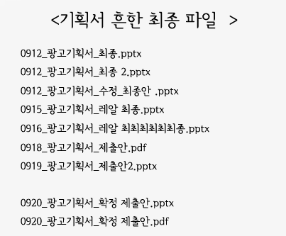

# Git

## 버전 관리

우리는 대학시절, 누구나 한 번은 버전 관리를 경험해 본 적이 있다. 예를 들어, 교수님께 과제를 제출하는 과정만 보아도 그렇다.
처음에 '레포트.txt'를 만들었다가 내용이 바뀔 경우 '레포트_최종.txt', '레포트_최종2.txt', '레포트_진짜최종.txt' 등등을 만들게 된다.
실제로 인터넷에 아래짤이 나돌며 많은 이들의 공감을 얻는 걸 본적이 있을 것이다.



마지막으로 수정한 파일이 마음에 들지 않으면 언제든지 이전 버전을 꺼낼 수 있게 백업을 하고 있었지 않은가? 알게 모르게 우리는 각 버전에 대해 관리를 하고 있던 셈이다.

## 버전 관리 시스템

과제나 기획서에만 그러한 버전 관리가 필요한 것은 아니다. 빨리 빨리 눈에 들어오지도 않는데다, 잘못 손대면 엉망이 되어 동작하지 않는 코드들을
사람의 손으로 관리하는 건 너무 위험 부담이 컸기 때문에, 개발자들은 아예 컴퓨터가 관리하도록 버전 관리 시스템이라는 걸 만들어 버렸다.

Git 은 대표적인 버전 관리 시스템 중 하나다. '최최최종' 따위의 이름을 붙이지 않고도 자동으로 버전 이름을 붙여주고, 굳이 예전버전 파일들을 끌어와
덮어쓰지 않아도 언제든지 명령어 하나로 예전 버전으로 돌릴 수 있는 시스템을 만든 것이다.


## 로컬과 리모트

로컬(local)과 리모트(remote)가 뭔지를 알아야 git 에 대해 이해할 수 있다. local 이라 함은 내 컴퓨터를 의미하고, remote 는 원격 서버를 의미한다.
결국은 네트워크를 통하느냐, 그렇지 않느냐로 결정이 된다.
내 컴퓨터 메모장에 열심히 수업 내용을 받아적는 것은 로컬 작업이고, 그 내용을 구글 드라이브처럼 클라우드에 저장하는 것은 원격 작업이다.

리모트가 쓰이게 된 이유는 간단하다. 로컬에서 작업하던 내용을 복구할 수 있게하는 백업이 필요했다. 정전이 나거나 하면 로컬 환경에서 작업했던 내용이 모두 날아가는 데,
두 손 놓고 그 광경을 바라보기가 끔찍했기 때문이다. 내 작업 이력을 원격에 수시로 백업하면 나중에 컴퓨터가 작업 내용을 잃어버려도 복구할 수 있다는 생각을 떠올린 것이다.

## Git 명령어

우리는 Git 명령어를 통해 Git 을 제어할 수 있다. 그러나 아무데서나 git 명령어를 친다고 버전 관리가 되는 것은 아니다.

우선 [Github](https://github.com/github) 에서 Repository 를 만들어야 한다. 여기서 만들어질 Repository 는 우리가 작업할 공간의 원격 저장소라고 보면 된다.

원격에 있는 저장소에서 clone 을 받아올 수 있다. clone은 원격에 있는 레포지토리를 로컬로 가져오는 작업이다.

```bash
git clone [remote repo주소]
```

여기까지 했다면, 로컬과 원격 모두 준비가 된 것이다. 하지만 고작 세팅 정도 단계만 끝난 것이고, 본격적으로 작업을 하기 전에 잡아둬야 할 개념이 있다.


위 그림에서 그 개념을 잘 설명하니, 꼭 기억해 두도록 하자. git에서는 위에서 설명했던 local 환경이라는 것을 3단계로 나누었다.

working directory, staging area, local repo 가 바로 그것이다.

working directory는 말 그대로 우리가 작업하는 공간이다. 기획서의 내용을 변경하는 곳이라고 보면 된다. 우리가 변경을 하게 되면 git이 알아서 변경사항을 추적해 준다.

git의 상태를 보는 명령어는 `status`인데, 이를 통해 우리가 변경한 내용을 추적하고 있음을 확인할 수 있다.
```bash
git status
```

staging area 는 변경할 내용을 진짜로 버전에 넣을 건지 말건지를 결정하기 위한 임시 장소라고 보면 된다. working directory에서 마구마구 변경했다가,
쓰잘데기 없는 변경들은 여기서 걸러내면 된다. 즉, staging area 는 '변경된 내용을 곧바로 버전에 집어넣기가 좀 그래서' 만들어 졌다.
`add` 명령어를 통해 staging area 로 '변경사항 자체'를 옮길 수 있다.

```bash
git add [변경된 디렉토리 or 파일]
```

local repo 는 '기획서_최최최종' 같은 이름을 써서 백업을 해놓는 곳이다(당연히 실제로 저런 이름을 쓰지는 않는다). staging area 에서 골라졌던 '진짜'들을
버전을 확정지어 로컬 환경에 저장해 두는 것이다. `commit` 을 통해 staging area 에 있는 변경사항을 local repo에 버전과 함께 저장할 수 있다.
이 때 버전은 컴퓨터가 자동으로 만들어 내는 해쉬 값(8f23f2e2b19add1... 이런 값을 해쉬라 한다)으로 곂칠일 없게 저장되고, 나는 그 버전에 대한 설명을 적으면 된다. 

`-m` 옵션을 통해 설명(메시지)을 추가할 수 있다.

```bash
git commit -m "이 버전에서 나는 무엇 무엇을 수정했습니다."
```

여기서 잠깐 vi 화면이 열릴텐데 이건 그냥 메모장 같은 거니 겁내지 말고 `:wq`를 타이핑하고 엔터를 치자. 더 수정할 게 없으니 메모장을 닫겠다는 의미이다.
여기까지 했다면 커밋 하나가 생성되는 것이고, 이는 곧 버전이 하나 생성된 거나 마찬가지기 때문에 커밋은 유사시 복구를 하는 단위가 된다.

커밋이 완료되면, local repo에 저장되지만 아직 원격에는 반영이 되지 않는 상태다. 즉, 이 상태로 정전이 나서 컴퓨터가 고장나면 영영 복구할 수 없게 된다.
원격에도 반영하고 싶다면 local repo와 remote repo의 싱크로를 맞추는 작업이 필요한데, 이걸 해주는 명령어는 `push`이다.

```bash
git push
```

여기까지가 보통 작업을 하게 되는 일반적인 플로우다. 여기서 만약 진짜로 컴퓨터가 고장나면 어떻게 될까? 겁먹지 않아도 좋다.
새로운 컴퓨터에서 `git clone [remote repo 주소]` 를 통해 로컬에 원격 레포에 반영된 사항(현재 상태)들을 가져올 수 있다.

그러나 2명 이상이 협업하는 경우를 생각해보자. 내가 로컬에서 작업을 하고 있을 때, 나와 같이 일하는 팀원이 원격에 `push`를 해버린 것이다.
즉, 내 팀원이 만들어낸 커밋이 원격에 있지만 내 로컬에서는 그 커밋이 없는 상황이다. 이 때 그 팀원이 만든 커밋을 가져오려면 `pull` 을 사용한다.

```bash
git pull
```

여기까지가 git 의 상태에 대해 개념적으로 설명한 것이다. 큰 틀은 위 내용을 따른다고 보면 된다.


실제로 협업이 이루어지는 과정에서는 커밋이 포함된 내용들이 서로 충돌하거나 하는 경우들이 있기 때문에 이제 이러한 부분에 대해 자세히 알아볼 것이다.
git merge 와 git checkout 도 밑에서 자세히 설명한다.

## 실제 협업이 이루어지는 과정

일반적으로 Github 을 이용한 협업 플로우는 아래 다이어그램을 따른다.


github 을 통해 협업을 하고자 하는 경우, 가장 먼저 갖춰져야 할 것은 원격 target repository다(그림에서 왼쪽 검은 문어).
원격 repository 가 준비가 되었다면 팀원들은 이 repository 를 fork를 받는다(`clone` 이 아님에 주의하자).

fork는 clone 처럼 복사와 관련된 명령어지만, 기본적으로 로컬과 상관이 없다. 협업할 대상인 원격 repository 를 원격에 있는 내 계정의 repository 에 복사하는 것이기 때문이다.  

그 다음, fork 해서 받아놓은 remote repository 를 로컬에 클론한다. 클론한 뒤부터는 위에서 설명했던 커밋을 다시 push 하는 과정이 이루어지는데,
이 과정에서 원래 있던 target repository에 [pull request](https://docs.github.com/en/github/collaborating-with-issues-and-pull-requests/about-pull-requests) 가 발생한다. 이 pull request는 target repository에 내 커밋을 제출하는 과정이며,
target repository를 관리하는 사람이 정책에 따라 pull request를 받을지 말지를 결정한다. 받아들여진다면 target repository에 병합(merged)된다.

그렇다면 target repository 와 내 repository 는 어떻게 sync를 맞출까? 그러기 위해서는 브랜치라는 개념을 알아야 한다.

### 브랜치

`git clone` 을 통해 레포지토리를 받아오게 되면 기본적으로 `master` 라는 브랜치가 생긴다. 이는 `git branch` 라는 명령어로 확인해 볼 수 있다.

```bash
git branch
```

브랜치란 작업을 하기 위해 뻗어나가기 위한 이름 그대로의 '브랜치(가지)'를 말한다.

예를 들어 블로그를 열심히 만들고 있었는데 댓글 기능을 추가해야 하는 상황이라고 하자. 댓글 기능을 구현해본적이 없어서 함부로 커밋하기가 망설여진디면, `reply` 라는 이름의 브랜치를 만들어서
실험적인 도전을 해볼 수 있다. 나중에 영 아니다 싶으면 브랜치만 삭제하면 되어 `master` 브랜치에는 영향이 가지 않기 때문이다.
만약 작업이 잘 되었다면 `reply` 라는 브랜치를 `master` 브랜치에 병합(merge)할 수도 있다.

브랜치를 만드는 명령어는 다음과 같다.

```bash
git checkout -b reply
```

`checkout` 은 원래 이름 그대로 branch 를 옮겨타는 명령어지만 `-b` 옵션을 통해 브랜치를 생성할 수도 있다.
실제로 이 상태에서 `git branch` 를 해보면 현재 `reply` 를 가리키고 있는 걸 알 수 있다. 


## 레포지토리 동기화

다시 협업 과정으로 돌아와보자.

브랜치는 결국 repository 마다 존재하는 것이기 때문에 원격 repository 에도 branch 가 존재한다.
위에서 `git pull`은 사실 `git pull master`에서 `master` 가 생략된 것인데,
이는 결국 원격 repository 의 `master` 를 로컬 repository의 `master` 에 싱크를 맞추는 작업이라고 할 수 있다.
이것이 가능한 이유는 `clone` 을 받으면서 원격에 있는 브랜치와 로컬에 있는 브랜치를 서로 연결했기 때문이다.

로컬에 있는 브랜치들이 원격에 어떤 식으로 연결되어 있는지 확인해보려면 `git remote -v` 라는 명령어를 사용한다.
아무런 설정도 하지 않았다면 아래와 같이 결과가 나올 것이다.

```
origin	https://github.com/사용자 이름/레포지토리 이름.git (fetch)
origin	https://github.com/사용자 이름/레포지토리 이름.git (push)
```

로컬에 있는 브랜치를 원격에 연결하기 위해서는 다음 명령어를 사용한다.

```bash
git remote add upstream [target remote repository 주소]
```

이러면 `upstream` 이라는 이름으로 원격에 있는 브랜치에 대한 참조를 설정한 것이다.
즉, 별칭일 뿐이지 실제로 브랜치는 아니다. `git remote -v` 를 통해 확인해보면 다음과 같음을 알 수 있다.

```
origin	https://github.com/사용자 이름/레포지토리 이름.git (fetch)
origin	https://github.com/사용자 이름/레포지토리 이름.git (push)
upstream	https://github.com/타깃 사용자 이름/타깃 레포지토리 이름.git (fetch)
upstream	https://github.com/타깃 사용자 이름/타깃 레포지토리 이름.git (push)
```

즉 `git pull upstream master` 을 하면 `upstream`, 즉 타깃 레포지토리의 데이터를 로컬 레포지토리의 `master`로 받아오는 것이다.
이를 통해 target repository와 내 repository를 동기화 시킬 수 있다.

`git log` 를 통해 지금까지 했던 작업을 확인해 볼 수 있다.

```bash
git log
```

## Git commit message BP

[여기서](https://chris.beams.io/posts/git-commit/) 잘 정리된 글을 볼 수 있다.

키 포인트는 다음과 같다.

- Separate subject from body with a blank line
- Limit the subject line to 50 characters
- Capitalize the subject line
- Do not end the subject line with a period
- Use the imperative mood in the subject line
- Wrap the body at 72 characters
- Use the body to explain what and why vs. how

## Github 의 Commit message 파싱

xxx가 이슈 넘버라고 했을 때 다음과 같은 문자열이 커밋 메세지에 포함되는 것만으로도 링크가 걸리거나 아예 이슈를 닫아버릴 수 있다. 

```
#xxx
fix #xxx
fixes #xxx
fixed #xxx
close #xxx
closes #xxx
closed #xxx
resolve #xxx
resolves #xxx
resolved #xxx
```

## Git credential

여러 github 계정을 관리하고자 하는 경우 매번 id/pw를 입력하는 건 짜증나는 일이다.
해결방법을 알아보자.

### For Linux

disk나 캐시 데몬을 통해 이 정보를 저장해 두고, 매번 입력하지 않도록 할 수 있다.

다음은 캐시 데몬을 쓰는 방법이다. 기본 15분간 유지되고 옵션으로 시간을 줄이거나 늘릴 수 있다.
```bash
git config credential.helper cache
```
캐시 데몬을 날려버리고 싶다면:
```bash
git credential-cache exit
```

다음은 Disk를 쓰는 방법이다. 영구적이지만 대신 파일에 민감한 정보가 노출된다.

```bash
git config credential.helper store
```

### Git credential for Mac

멕은 좀더 우아하다.

아래 명령어로 credential-osxkeychain 이 설치되어 있는지 확인해본다.
```bash
git credential-osxkeychain
```

만약 설치되지 않았다면:
```bash
brew install git
```
Global 하게 설정해버리자:
```bash
git config --global credential.helper osxkeychain
```
위와 같이 설정되면 멕의 키체인에 https로 github에 접근할 때 credential을 저장해준다.

## Git difftool

git config 에서 difftool 로 vim 설정해두고 zshrc에서

```bash
alias diff="git difftool -y"
```

해두면 편리하다.

만약 지금 내가 변경한 사항들의 diff가 아니라 커밋의 diff를 보고 싶다면
```bash
diff HEAD~1

// 혹은 아래처럼 등록
alias show="git difftool -y HEAD~1"
```

하면 된다.

## Unstaged stash

Unstaged 상태인 녀석들 stash하고 싶다면 다음과 같이 하면 된다.
```bash
git stash -k
```

Untracked 인 녀석들까지 같이 stash 하고 싶다면 다음과 같이 한다:
```bash
git stash -k -u
```

## Untracked -> Tracked

git diff 는 매우 유용한데, untracked files에 대해서는 조회할 수 없다.
이 때 Untracked 를 Tracked로 만들어서 보면 되는데, 방법은 다음과 같다:

```bash
git add -N .
```
