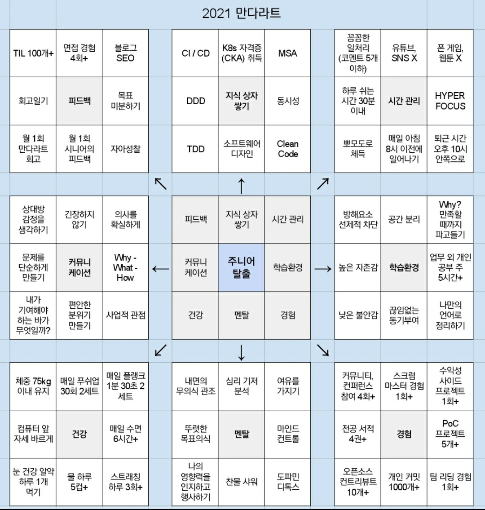

# 2021 년 회고록

## Intro

작년을 허망하게 흘려보낸 것에 절치부심하여 2021년의 해가 밝자마자 내가 한 일은 바로 만다라트(Mandal-art) 작성이었다.

2021년 한 해를 책임질 한 가운데 푸른 정사각형에는 뭐라고 적어야 할까. 거듭 고쳐가며 오랜 고민 끝에 간신히 적은 단어는 **주니어 탈출**이었다.
2020년을 회고하면서 비추어보았던 나의 모습에서 가장 부숴버리고 싶었던 것이 '**큰 일을 맡기면 뭔가 불안해서 계속 신경써주지 않으면 안되는**' 모습이었기 때문이다.

## 주니어와 시니어의 차이

가운데 박스 안을 채워넣고 난 후, 나는 내가 생각하는 주니어와 시니어의 차이점을 다음과 같이 정리했다.

- 시니어는 꽤 큰 규모의 소프트웨어 디자인을 할 수 있어야 한다. 여기서 꽤 큰 규모라는 것은 최소한 비즈니스적으로 가치를 창출할 수 있는 정도의 프로젝트 규모이다.
- 시니어는 팀을 리딩할 수 있어야 한다. 이는 타 직군과의 커뮤니케이션, 인적 리소스 관리, 일정 관리, 프로젝트 매니징, 생산성, 도메인의 이해 등을 모두 포괄한다.
- 시니어는 제너럴한 지식이 풍부해야 하고, 이를 근거로 프로젝트와 팀을 위해 현명한 판단을 내릴 수 있어야 한다.

위 차이점을 토대로 81칸을 모두 채워 만다라트를 전부 완성하기까지는 2주일이 걸렸고,
다음 2주일 동안은 몇 회, 몇 권 등 현실적인 숫자들을 동원해 가능한 한 구체적으로 항목들을 정리했다.
목표를 아주 구체적인 레벨로 적어놓아야 더 잘 기억나고, 오히려 더 지키기도 쉬워진다는 것을 만다라트를 지속적으로 수정하고 또 지키려 노력하는 과정 속에서
깨달았기 때문이다.

## 현재(3월 말)까지 만다라트 수치목표 회고

피드백

* 회고 일기 76개 
* TIL 46개
* 면접 경험 3회

지식 상자

* CKA 취득 준비중

시간 관리

* 코멘트 5개를 초과하는 CL 개수 약 7개
* 8시 이후에 일어난 적 거의 대부분(...)
* 퇴근 시간 10시 넘긴 적 대략 10번 정도..?

학습 환경

* 주 5시간 미만으로 공부한 주: 1주

경험

* 스크럼 마스터 경험 0회
* 커뮤니티, 컨퍼런스 참여 0회
* 전공서적 오브젝트, 클린코드 읽는 중
* 개인 커밋: 321개
* 오픈소스 컨트리뷰트: 1개
* 사이드/POC 프로젝트: 3개

건강

* 체중 76Kg 이내 항상 유지 중
* 푸쉬업 30회 2세트 하지 않은 날: 10일
* 플랭크 1분 30초 2세트 하지 않은 날: 10일
* 눈 건강 알약 안 먹은 날: 한 3번 정도..?
* 물 하루 5컵 이상 마시지 않은 날: 거의 대부분(...)
* 스트래칭은 3회 이상 하지 않은 날: 거의 대부분(...)
* 수면 평균적으로 치면 주 6시간씩은 자는데, 너무 들쭉날쭉이다.

## 1월 회고

좋아하는 것과, 잘하는 것과, 하고 싶은 것에 대해 고민하라는 조언을 얻었다. 커리어를 쌓는 과정에서 선택의 기로에 설 때,
위 3가지 기준이 얼마나 만족하는 가를 따지면 좀 더 주체적이고 확신을 주는 결론을 얻을 수 있다.
가장 좋은 경우는 덕업일치로, 위 3가지 기준이 모두 합치되는 경우다.

개발과 관련해서 내게 욕심이 있다면, 아직 자신없는 분야인 소프트웨어 디자인을 정복하는 것이었다. 자신 없는 분야? 그건 머신러닝이나 DevOps도 마찬가지잖아.
스스로에게 묻는다. 그 분야들도 정복하고 싶은가? 아니다. 나는 재미를 느끼지 못하는 것들에 대해서는 욕심을 내지 않는다.
그저 언젠간 해야한다는 한껏 게으른 다짐만 챙길 뿐이다(사실 DevOps도 해보면 재밌을 거 같긴 해...).

나는 소프트웨어가 문제를 해석하는 관점에 따라 코드가 천지개벽하게 되는 메커니즘에 대해 흥미를 느끼고 있는 것 같다.
소프트웨어를 개발하면서 우리들은 문제를 해석하며 끊임없이 다음과 같은 질문들에 고민하고 대답한다.
추상화를 통해서 디테일을 감추고 변화에 유연한 소프트웨어를 만든다?
어디까지가 디테일이고 어떻게 감출 수 있는데?
어떻게 해석하느냐에 따라 다른 거 아니야?
대관절 어떻게해야 기술적이지 않으면서 논리에 빈틈이 없는 문장들로 소프트웨어가 해결하고자 하는 문제를 풀어낼 수 있는 건데?
어디까지를 '기술적'이라고 봐야하는데?

이 질문들에 대한 답을 찾는 데에는 정답이 없다. 다만 유연할 수록 좋은 설계다라는 절대적이지 조차 않은 채점 기준만 있을 뿐이다.
이것은 비유하자면 서술형 답안지에 내 생각을 코드로 표현하는 것이 되는데, 작성하는 사람에 따라 답안지는 천차만별로 달라진다.

고맙게도(혹은 다행스럽게도) 이게 의의로 나를 즐겁게 하더라는 것이다.
여기에는 내 생각을 글이나 그림, 혹은 다른 무언가로 표현하길 좋아하는 나의 특징이 결정적으로 기여하지 않았나 싶다.
스스로 내 자신이 그런 질문들에 좋은 대답들을 내놓고 있다고 생각하지 않는데도 불구하고 답을 찾는 것에 흥미를 가지는 것을 보면,
내게도 덕업일치가 되는 길이 닫혀있지는 않은가보다 싶다. 내가 **잘하기만 한다면** 그야말로 좋아하고, 잘하고, 하고싶은 걸 하는 게 되는 것이기 때문이다.

2020년 회고에서 나는 '함께 일하고 싶은 개발자'가 되고자 했다. 하지만 조언을 듣고 생각을 정리하고보니, 내 꿈은 '**클린 아키텍트**'로 구체화 되었다.
앞으로 내가 내릴 결정들에 있어서 중요한 나침반 역할을 해줄 소중한 꿈이지만, 아직 더 구체화할 부분들이 많이 남았다. 올 한 해동안 천천히 답해갈 생각이다.

* 무엇을 보고 클린하다고 말할 수 하는가
* 코딩을 하지 않는 아키텍트는 아키텍트라 할 수 있는가
* 팀에서 아키텍트가 맡는 역할은 무엇인가
* 좋은 아키텍처를 찾아내기 위한 접근 방식에는 무엇이 있는가
* 디테일을 모르고서는 좋은 설계를 낼 수 없다. 어디까지를 구분지어야 할 지 모르기 때문이다. 그럼 이런 디테일은 어떻게 정복해야 할까?

## 2월 회고

2월은 실전적인 설계 경험을 할 수 있었던 아주 의미있는 달이었다. 디자인 독 작성에서부터 실제 구현에 이르기까지 시니어 엔지니어의
피드백을 받아가면서 고치고 부수고를 반복했다. 방송 스트리밍이라는 유니크한 도메인에서 DDD로 설계하는 것은 상당히 고민이 많이 필요한
일이었고, 이 과정에서 오브젝트라는 책이 정말 도움이 많이 되었다. 결과적으로 보았을 때 지금 설계가 완벽하다라고 볼 수는 없지만
책임을 위주로 객체를 설계하는 것이 무엇이고 또 그러한 객체들을 DDD의 어느 부분에 위치시킬지에 대한 고민들을 해봤던 것이 좋았다.
하나 아쉬운 점은, 이 과정에서 내가 시간을 너무 오래 끌어 팀에 병목을 유발했다는 것이다. 어떻게 하면 더 빠르게 할 수 있었을까?
수많은 경험이 답일까? 나는 결국 주말까지 반납해 가면서 코딩을 했다.

러닝테스트의 위력을 알았던 것도 좋았다. 사용법을 잘 모르는 라이브러리를 사용할 때 러닝테스트는 아주 큰 힘을 발휘한다.
가장 큰 효과는 TDD 진입장벽을 크게 낮춘다는 것이다. 예를 들어, Rx 관련된 라이브러리의 사용법을 잘 모른다면 러닝테스트를 작성하여
충분히 사용법을 인지한 후에 TDD를 하는 걸 생각해볼 수 있다. 이 경우 개인적으로 사용법을 모르고 TDD를 하려고 했을 때의 막막함을
훨씬 덜어내는 듯 했다.

사내에서 공식적으로 진행하는 피어리뷰(동료들로부터 받는 피드백)를 받았는데, '**가끔 너무 깊게 한 가지에 파고드는 경향이 있다**'는 피드백을 받았다.
프로젝트의 원활한 진행을 위해 리서치에 너무 많은 시간을 투자하지 말라는 뜻으로 보인다. 나름 필요한 것만 쏙쏙빼다가 구현하는 걸 남들보단
잘한다고 생각하고 있었지만, 어떤 모습을 상상하시고 그런 피드백들을 주셨을지 상상이 가 속으로만 조용히 아쉬웠다.
그동안 일을 하면서 완전히 모르는 분야를 정복하는 데에 다음 중 어떤 루트를 탈지 스스로 결정을 잘 내리지 못했다.

* 1시간을 투자해서 컨셉만 훑는다.
* 3시간을 투자해서 튜토리얼을 따라하거나, 로컬환경에서 직접 간단히 돌려본다.
* 하루를 투자해서 PoC 프로젝트를 만들어 프로덕트에 이용할 가치가 있을만한 샘플코드를 얻는다.

1시간 투자해서 컨셉만 잡아야지 했다가도 파면 팔수록 너무 모르는 게 많이 나와 컨셉 잡는 데만 오랜 시간이 걸렸던 적도 있었고,
하루를 투자해서 PoC 프로젝트를 만들어보려다 컨셉을 잘 몰라서 이상한 부분에서 삽질하며 헤맸던 적도 있었다. 무엇보다 내가 모르는 개념이
나왔을 때 이걸 알아야 하는 건지 조차 헷갈렸다. 그 최소한의 가이드라인을 얻으려면 더욱 추상적인 수준에서의 리서치가 필요해보인다.

만다라트에 **CKA 자격증 취득**을 '지식 상자 쌓기' 카테고리 아래에 새로 적었다. 정말 좋은 목표인 것 같다. 이처럼 정량적인 성과 측정이 가능한
목표는 만다라트와 찰떡궁합이다. 일단은 6월 전에 자격증 취득이 목표다. 이 외에 만다라트를 지키면서 하고 있던 회고일기의 좋은 점을
발견했는데, 내가 어떤 부분에 무의미하게 시간을 낭비하고 있는지 쉽게 알 수 있다는 점이다. 나는 만다라트에  폰 게임, 웹툰, 유튜브,
SNS 를 하지 않겠다는 목표를 새로 적었다. 마지막으로 만다라트에는 없지만 가계부 작성을 시작했다. 이건 그냥 매달 말 정리하게 될 것 같다.

다음 달부터는 피어리뷰를 의식하면서 커뮤니티 참여, 개인 커밋이나 오픈소스 컨트리뷰트를 좀 더 신경써야 할 것 같다.

## 3월 회고

3월 초를 넘어가면서 번아웃이 왔다. 이직을 결정하면서 재직 중이던 회사에 퇴사를 통보했는데, 이 과정에서 커뮤니케이션 미스로 감정 소모를
꽤 했었다. 이 때 받았던 스트레스와 작년 12월 ~ 2월을 마치 기계처럼 살며 쌓인 억눌린 피로감이 한데 뭉쳐 나를 짓뭉갰던 것이 아마도 번아웃을
유도했던 것 같다. 회사에서 진행하고 있던 일이 잘 안풀렸던 것도 한 몫을 더 했을 것이다. 

번아웃이 오고 나서 내가 하는 행동들은 하나같이 한심하기 짝이 없었다. 침대에 누워 인생에 별 도움도 안되는 유튜브를 보며 킬킬대거나 
폰 게임을 하거나 심지어 컴퓨터 게임을 했다. 모닝 루틴마저 스킵하는 날들이 생겼고 저녁마다 기름진 음식으로 폭식하며 위장을 채웠다.
절제된 생활습관으로 도파민 디톡스를 해오던 내 몸에 이런 자극들은 짜릿한 마약처럼 나를 구렁에 빠뜨렸고
나는 여지없이 매슬로의 욕구계층 가장 밑바닥을 눈을 가린 채 짐슴마냥 기어다녔다.

지금은 다행히 어느 정도 다시 원래대로 돌아오려고 노력하는 중이다. 이 와중에 계획했던 K8s 인프런 강의를 끝까지 완주하는 데 성공했고,
새로운 스터디 클럽에 추가적으로 가입했다. 노트를 사서 그 날 해야 하는 일을 적기 시작했고, 그 일을 다 끝내면 내가 뭘 하든 스스로
간섭하지 않기로 했다. 다만 그 전까지는 무조건 그걸 다 끝내는 데 집중하기로 규칙도 정했다.

3월 회고를 하면서 알게 된 건, 나는 스트레스를 관리하는 능력이 형편없다는 것이다. 내가 뭘 하면 스트레스를 받는지는 알겠는데, 뭘 해야
스트레스가 풀리는지는 잘 모르는 것 같다. 번아웃을 막기 위해서는 좀 더 섬세하게 나를 관찰할 필요가 있어보인다. 4월은 부끄럽지 않게
마주할 수 있길 바란다.
