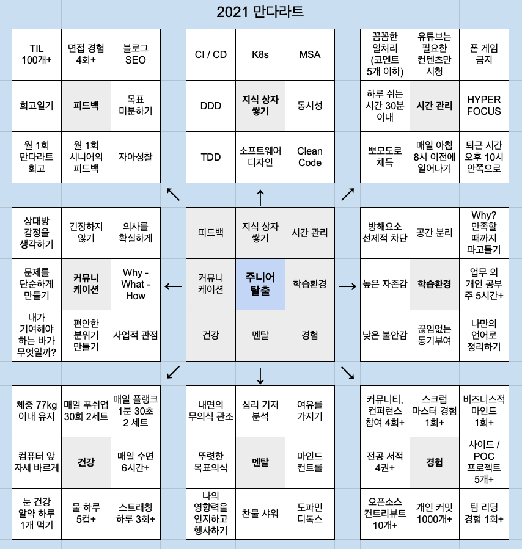

# 2021 년 회고록

## Intro

작년을 허망하게 흘려보낸 것에 절치부심하여 2021년이 되자마자 내가 한 일은 바로 만다라트(Mandal-art) 작성이었다.

2021년 한 해를 책임질 한 가운데 푸른 정사각형에는 뭐라고 적어야 할까. 거듭해서 고치고 오랜 고민 끝에 간신히 적은 단어는 **주니어 탈출**이었다.
2020년 나의 모습에서 가장 부숴버리고 싶었던 모습이 '**큰 일을 맡기면 뭔가 불안해서 계속 신경써주지 않으면 안되는**' 내 모습이었기 때문이다.

가운데 박스 안을 채워넣고 난 후, 나는 내가 생각하는 주니어와 시니어의 차이점을 다음과 같이 정리했다.

- 시니어는 꽤 큰 규모의 소프트웨어 디자인을 할 수 있어야 한다. 여기서 꽤 큰 규모라는 것은 비즈니스적으로 가치를 창출할 수 있는 프로젝트 정도의 규모를 의미한다.
- 시니어는 팀을 리딩할 수 있어야 한다. 이는 타 직군과의 커뮤니케이션, 인적 리소스 관리, 일정 관리, 프로젝트 매니징, 생산성, 도메인의 이해 등을 모두 포괄한다.
- 시니어는 제너럴한 지식이 풍부해야 하고, 이를 근거로 프로젝트와 팀을 위해 현명한 판단을 내릴 수 있어야 한다.

위 차이점을 토대로 81칸을 모두 채워 만다라트를 전부 완성하기까지는 2주일이 걸렸고,
다음 2주일 동안은 몇 회, 몇 권 등 현실적인 숫자들을 동원해 가능한 한 구체적으로 항목들을 정리했다.
목표를 아주 구체적인 레벨로 적어놓아야 더 잘 기억나고, 오히려 더 지키기도 쉬워진다는 것을 만다라트를 지속적으로 수정하고 또 지키려 노력하는 과정 속에서
깨달았기 때문이다.

## 1월까지 만다라트 회고

만다라트 회고는 달마다 합칠 예정이다. 그렇게 12월이 되면 나는 자연스레 1년 동안의 만다라트 회고를 얻는다.

피드백

* 회고 일기 4일을 제외하고 모두 작성 
* TIL +13개
* 면접 경험 +2회
* 나머진 모두 성취

지식 상자

* TDD, DDD, Clean Code, 소프트웨어 디자인에 대해 공부하는 중.
* 특히 Clean Code 는 5번이 넘게 읽었음에도 볼 때마다 새로운 내용이 눈에 들어와서, 이젠 아예 외워야 겠다 생각 중.

시간 관리

* 하루 쉬는 시간 30분 이내 잘 안지켜짐. 에너지가 바닥나면 아무것도 못하겠다.
* 유튜브 필요한 컨텐츠만 시청하는 거 솔직히 잘 안된다. 하지만 요새는 자기계발, 프로그래밍 쪽 영샹을 많이 본다.
* 8시 이전에 잘 못일어남... 대략 9시나 10시쯤 일어난다.
* 뽀모도로 역시 여간해선 집중을 방해하는 듯한 느낌이 든다.

**즉, 나의 시간 관리 능력은 형편없다.** 

학습 환경

* Why 파고들기가 잘 안된다. 시간에 자꾸 타협하는 느낌.
* 나머진 봐줄만 하게 나름 잘 하고 있음

경험

* 전공 서적 Clean Code 하나 외우려고 하는 중이다. 심플 소프트웨어라는 책도 사서 봤는데 내용이 하나도 기억이 안나서 안 읽은 걸로.
* 개인 커밋 +184개
* 오픈소스에 컨트리뷰트 PR은 3개 올렸으나 전부 간단하고 비활동적인 오픈소스들이라 머지해주지 않는다.
* 사이드/POC 프로젝트는 벌써 3개를 만들었다.

멘탈

* 유난히 추운 겨울이었음에도 만다라트에 적혀있다는 이유 하나만으로 찬물 샤워를 시작했다. 진짜 죽을 맛이지만, 막상 하고나면 도전에
  대한 두려움이 사라지는 효과가 있는 것 같다.
* 도파민 디톡스를 위해 뇌에 자극적인 행동은 삼가는 중

건강

* 수면과 컴퓨터 앞 자세 바르게를 제외하고는 대부분 거른 적이 없다.

커뮤니케이션

* 솔직히 이 카테고리는 평가를 내리기가 어렵다.

## 1월 회고

좋아하는 것과, 잘하는 것과, 하고 싶은 것에 대해 고민하라는 조언을 얻었다. 커리어를 쌓는 과정에서 선택의 기로에 설 때,
위 3가지 기준이 얼마나 만족하는 가를 따지면 좀 더 주체적이고 확신을 주는 결론을 얻을 수 있다.
가장 좋은 경우는 덕업일치로, 위 3가지 기준이 모두 합치되는 경우다.

개발과 관련해서 내게 욕심이 있다면, 아직 자신없는 분야인 소프트웨어 디자인을 정복하는 것이었다. 자신 없는 분야? 그건 머신러닝이나 DevOps도 마찬가지잖아.
스스로에게 묻는다. 그 분야들도 정복하고 싶은가? 아니다. 나는 재미를 느끼지 못하는 것들에 대해서는 욕심을 내지 않는다.
그저 언젠간 해야한다는 한껏 게으른 다짐만 챙길 뿐이다(사실 DevOps도 해보면 재밌을 거 같긴 해...).

나는 소프트웨어가 문제를 해석하는 관점에 따라 코드가 천지개벽하게 되는 메커니즘에 대해 흥미를 느끼고 있는 것 같다.
소프트웨어를 개발하면서 우리들은 문제를 해석하며 끊임없이 다음과 같은 질문들에 고민하고 대답한다.
추상화를 통해서 디테일을 감추고 변화에 유연한 소프트웨어를 만든다?
어디까지가 디테일이고 어떻게 감출 수 있는데?
어떻게 해석하느냐에 따라 다른 거 아니야?
대관절 어떻게해야 기술적이지 않으면서 논리에 빈틈이 없는 문장들로 소프트웨어가 해결하고자 하는 문제를 풀어낼 수 있는 건데?
어디까지를 '기술적'이라고 봐야하는데?

이 질문들에 대한 답을 찾는 데에는 정답이 없다. 다만 유연할 수록 좋은 설계다라는 절대적이지 조차 않은 채점 기준만 있을 뿐이다.
이것은 비유하자면 서술형 답안지에 내 생각을 코드로 표현하는 것이 되는데, 작성하는 사람에 따라 답안지는 천차만별로 달라진다.

고맙게도(혹은 다행스럽게도) 이게 의의로 나를 즐겁게 하더라는 것이다.
여기에는 내 생각을 글이나 그림, 혹은 다른 무언가로 표현하길 좋아하는 나의 특징이 결정적으로 기여하지 않았나 싶다.
스스로 내 자신이 그런 질문들에 좋은 대답들을 내놓고 있다고 생각하지 않는데도 불구하고 답을 찾는 것에 흥미를 가지는 것을 보면,
내게도 덕업일치가 되는 길이 닫혀있지는 않은가보다 싶다. 내가 **잘하기만 한다면** 그야말로 좋아하고, 잘하고, 하고싶은 걸 하는 게 되는 것이기 때문이다.

2020년 회고에서 나는 '함께 일하고 싶은 개발자'가 되고자 했다. 하지만 조언을 듣고 생각을 정리하고보니, 내 꿈은 '**클린 아키텍트**'로 구체화 되었다.
앞으로 내가 내릴 결정들에 있어서 중요한 나침반 역할을 해줄 소중한 꿈이지만, 아직 더 구체화할 부분들이 많이 남았다. 올 한 해동안 천천히 답해갈 생각이다.

* 무엇을 보고 클린하다고 말할 수 하는가
* 코딩을 하지 않는 아키텍트는 아키텍트라 할 수 있는가
* 팀에서 아키텍트가 맡는 역할은 무엇인가
* 좋은 아키텍처를 찾아내기 위한 접근 방식에는 무엇이 있는가
* 디테일을 모르고서는 좋은 설계를 낼 수 없다. 어디까지를 구분지어야 할 지 모르기 때문이다. 그럼 이런 디테일은 어떻게 정복해야 할까?
